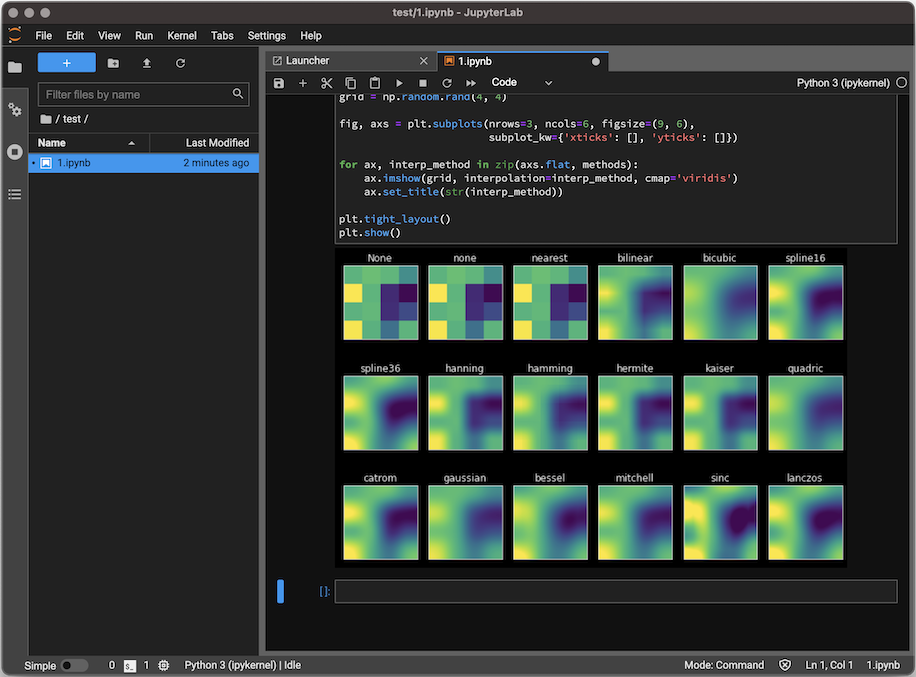

# JupyterLab Desktop

A desktop application for [JupyterLab](https://github.com/jupyterlab/jupyterlab), based on [Electron](https://www.electronjs.org/).



JupyterLab Desktop currently supports user-friendly [prebuilt](https://jupyterlab.readthedocs.io/en/stable/extension/extension_dev.html#overview-of-extensions) extensions. Source extensions which require rebuilding are not supported.

## Download


Before installing please read the [Python Environment Customization Guide](user-guide.md#Customizing-the-Bundled-Python-Environment) if you plan to customize the Python environment to add new packages. If you have an existing JupyterLab Desktop installation, please uninstall it first by following the [uninstall instructions](user-guide.md#uninstalling-jupyterlab-desktop).

- [Debian, Ubuntu Linux Installer](https://github.com/jupyterlab/jupyterlab-desktop/releases/latest/download/JupyterLab-Setup-Debian.deb)
- [Red Hat, Fedora, SUSE Linux Installer](https://github.com/jupyterlab/jupyterlab-desktop/releases/latest/download/JupyterLab-Setup-Fedora.rpm)
- [macOS Installer](https://github.com/jupyterlab/jupyterlab-desktop/releases/latest/download/JupyterLab-Setup-macOS.pkg)
- [Windows Installer](https://github.com/jupyterlab/jupyterlab-desktop/releases/latest/download/JupyterLab-Setup-Windows.exe)

## Launching JupyterLab Desktop

JupyterLab Desktop can be launched from the GUI of your operating system by clicking the application's icon or by using `jlab` command from the command line. Double clicking `.ipynb` files is also supported and it will launch JupyterLab Desktop and load the notebook file.

JupyterLab Desktop sets File Browser's root directory based on the launch method.
- If launched from the application icon on GUI or by using `jlab` command without any arguments, then user's home is set as the root directory.
- If launched by double clicking `.ipynb` file or `jlab` command with a file path as the argument, then file's parent directory is set as the root directory.
- If `jlab` command is used with a directory path as the argument then the directory in the argument is set as the root directory.

### jlab command-line launch examples
- Open directories using relative or absolute path
  - `jlab .` launch in current directory
  - `jlab ../notebooks` launch with relative path
  - `jlab /Users/username/notebooks` launch with absolute path
- Open notebooks and other files using relative or absolute path
  - `jlab /Users/username/notebooks/test.ipynb` launch notebook with absolute path
  - `jlab ../notebooks/test.ipynb` launch notebook with relative path
  - `jlab ../test.py` launch python file with relative path

### Configuration files

By default JupyterLab Desktop will only load and write to Jupyter configuration located in:
- `%APPDATA%\jupyterlab-desktop` on Windows
- `$XDG_CONFIG_HOME/jupyterlab-desktop` or `~/.config/jupyterlab-desktop` on Linux
- `~/Library/Application\ Support/jupyterlab-desktop` on macOS

ignoring any other Jupyter configuration which may be present in standard Jupyter paths as defined by `jupyter --paths`.
This includes `jupyter-server` settings, `jupyterlab` settings and workspaces, and any other configuration which would
normally be shared between Jupyter installations.
This is necessary to prevent a clash between the Desktop and any previous Jupyter installation.

You can change the configuration path by specifying `JLAB_DESKTOP_CONFIG_DIR` environment variable.

For instructions on how to copy the settings from previous JupyterLab installation please see the [user guide](user-guide.md#Copying-configuration-from-previous-installation).

## Build dependencies

- [conda](https://docs.conda.io)
    
    You can install `conda` as part of a [Miniforge](https://github.com/conda-forge/miniforge) installer.
    

- [(conda) Constructor](https://github.com/conda/constructor) to bundle JupyterLab Desktop Server into the stand-alone application. You can install Constructor using:

    ```bash
    conda install -c conda-forge constructor
    ```

- nodejs

    You can install from https://nodejs.org/en/download/ or run:
    ```bash
    conda install -c conda-forge nodejs
    ```

- yarn

    Install using
    ```bash
    npm install --global yarn
    ```

## Local development

JupyterLab Desktop bundles JupyterLab front-end and a conda environment as JupyterLab Desktop Server as its backend into an Electron application.

`<platform>`: mac, linux or win

- Get the project source code

    ```bash
    git clone https://github.com/jupyterlab/jupyterlab-desktop.git
    ```

- Install dependencies and build JupyterLab Desktop

    ```bash
    yarn
    yarn build
    ```

- Create the JupyterLab Desktop Server installer using

    ```bash
    yarn create_env_installer:<platform>
    ```

    Installer will be created in one of `env_installer/JupyterLabDesktopAppServer<version>-MacOSX-x86_64.sh`, `env_installer/JupyterLabDesktopAppServer-<version>-Linux-x86_64.sh`, `env_installer/JupyterLabDesktopAppServer-<version>-Windows-x86_64.exe` based on your platform

- Run the installer to install the JupyterLab Desktop Server. Make sure to set install location to `jlab_server` directory that is at the same level as `jupyterlab-desktop` project source code

- Now you can launch the JupyterLab Desktop locally using:

    ```bash
    yarn start
    ```

## Building for distribution

- Build the application

    ```bash
    yarn run clean && yarn build
    ```

- Create JupyterLab Desktop Server installer

    ```bash
    yarn create_env_installer:<platform>
    ```

- Create JupyterLab Desktop installer which will also bundle JupyterLab Desktop Server installer.

    ```bash
    yarn dist:<platform>
    ```

    Application Installer will be created in `dist/JupyterLab.pkg` (macOS), `dist/JupyterLab.deb` (Debian, Ubuntu), `dist/JupyterLab.rpm` (Red Hat, Fedora) and `dist/JupyterLab-Setup.exe` (Windows) based on the platform

## Release Instructions

For instructions on updating bundled JupyterLab packages and cutting a new release, please follow [Release.md](Release.md) document.
