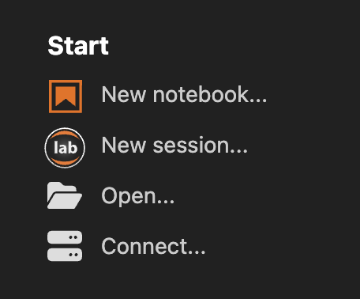
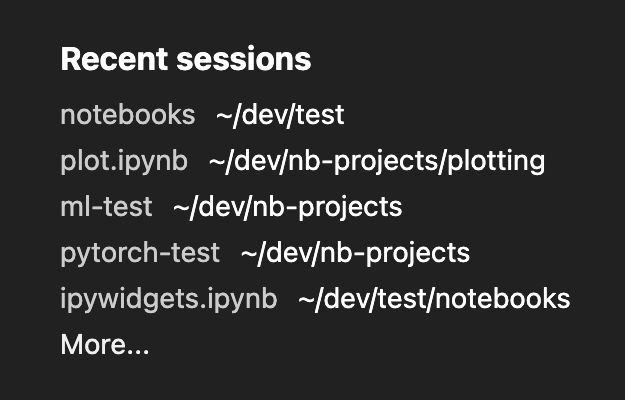

# JupyterLab Desktop

JupyterLab Desktop is the cross-platform desktop application for [JupyterLab](https://github.com/jupyterlab/jupyterlab). It is the quickest and easiest way to get started with Jupyter notebooks on your personal computer, with the flexibility for advanced use cases.

## Installation

If you have an existing JupyterLab Desktop installation, please uninstall it first by following the [uninstall instructions](user-guide.md#uninstalling-jupyterlab-desktop).

- [Debian, Ubuntu Linux Installer](https://github.com/jupyterlab/jupyterlab-desktop/releases/latest/download/JupyterLab-Setup-Debian-x64.deb)
- [Red Hat, Fedora, SUSE Linux Installer](https://github.com/jupyterlab/jupyterlab-desktop/releases/latest/download/JupyterLab-Setup-Fedora-x64.rpm)
- [macOS Intel Installer](https://github.com/jupyterlab/jupyterlab-desktop/releases/latest/download/JupyterLab-Setup-macOS-x64.dmg), [macOS Apple silicon Installer](https://github.com/jupyterlab/jupyterlab-desktop/releases/latest/download/JupyterLab-Setup-macOS-arm64.dmg)
- [Windows Installer](https://github.com/jupyterlab/jupyterlab-desktop/releases/latest/download/JupyterLab-Setup-Windows-x64.exe)

Additionally, JupyterLab Desktop can be installed on Windows via winget: `winget install jupyterlab`.

Please check out the [Python Environment Customization Guide](user-guide.md#Customizing-the-Bundled-Python-Environment) if you plan to customize the Python environment to add new packages.

## Launching JupyterLab Desktop

JupyterLab Desktop can be launched from the GUI of your operating system by clicking the application's icon or by using `jlab` command from the command line. Double clicking `.ipynb` files is also supported and it will launch JupyterLab Desktop and load the notebook file.

JupyterLab Desktop sets File Browser's root directory based on the launch method.

- If launched from the application icon on GUI or by using `jlab` command without any arguments, then the default working directory is set as the root directory. The default working directory is user home directory but it can be customized from the Settings dialog.
- If launched by double clicking `.ipynb` file or `jlab` command with a file path as the argument, then file's parent directory is set as the root directory. Similarly, if a file is opened using the `Open...` or `Open File...` links in the Start section or by using drag & drop, then file's parent directory is set as the root directory.
- If `jlab` command is used with a directory path as the argument or with the `--working-dir` argument then the directory in the argument is set as the root directory. Similarly, if a folder is opened using the `Open Folder...` link in the Start section or by using drag & drop, then the opened directory is set as the root directory

## Sessions and Projects

Sessions represent local project launches and connections to existing JupyterLab servers. Each JupyterLab UI window in the app is associated with a separate session and sessions can be restored with the same configuration later on.

Each launch of JupyterLab in a different working directory is a separate project and projects can have their own configuration such as Python environment and UI layout.

### Session start options

You can start a new session by using the links at the Start section of the Welcome Page.

- `New notebook...` creates a new notebook in the default working directory.
- `New session...` launches a new JupyterLab session in the default working directory.
- `Open...` starts a new JupyterLab session in the selected working directory. If files are chosen, selected files' parent directory becomes the working directory and selected files are opened in the session. On Windows and Linux `Open Folder...` and `Open Files...` options are presented as separate items.
- `Connect...` creates a session by connecting to an existing JupyterLab server running locally or remotely. Locally running JupyterLab servers are automatically detected and listed in the Connect dialog.

Similarly, CLI launches of the application, dropping files and folders, and double clicking to open files create new sessions as well.

Previously opened sessions are stored as part of application data and they are listed on Welcome Page. Clicking an item in the `Recent sessions` list restores the selected session.

### jlab command-line launch examples

- Open directories using relative or absolute path
  - `jlab .` launch in current directory
  - `jlab ../notebooks` launch with relative path
  - `jlab /Users/username/notebooks` launch with absolute path
- Open notebooks and other files using relative or absolute path
  - `jlab /Users/username/notebooks/test.ipynb` launch notebook with absolute path
  - `jlab ../notebooks/test.ipynb` launch notebook with relative path
  - `jlab ../test.py` launch python file with relative path
- Open with a custom Python environment
  - `jlab --python-path /Users/username/custom_env/bin/python ../notebooks/test.ipynb` launch notebook with custom Python environment
- Connect to existing JupyterLab server
  - `jlab https://example.org/lab?token=abcde`

See [CLI documentation](cli.md) for more CLI commands and options.

### JupyterLab Extension support

JupyterLab Desktop currently supports user-friendly [prebuilt](https://jupyterlab.readthedocs.io/en/stable/extension/extension_dev.html#overview-of-extensions) extensions. Source extensions which require rebuilding are not supported.

### Guides and Help

- See [user guide](user-guide.md) for configuration options

- [Python environment management](python-env-management.md) guide for managing Python environments on your system using JupyterLab Desktop

- See [CLI documentation](cli.md) for CLI commands and options

- See [troubleshooting guide](troubleshoot.md) for troubleshooting issues

- For contributing, see [developer documentation](dev.md)
