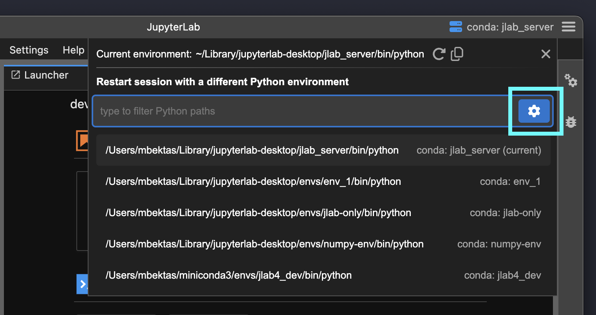
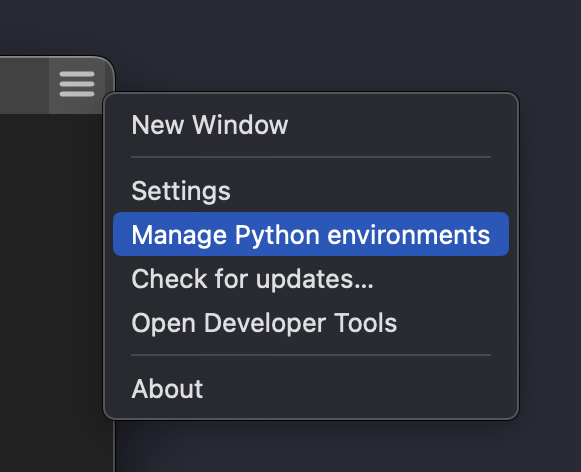
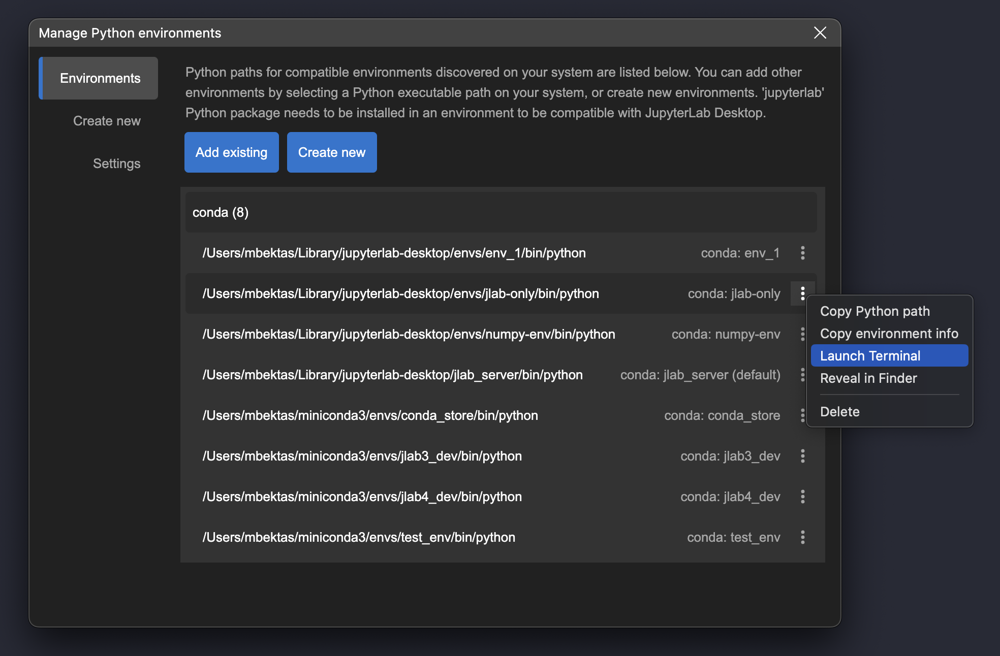
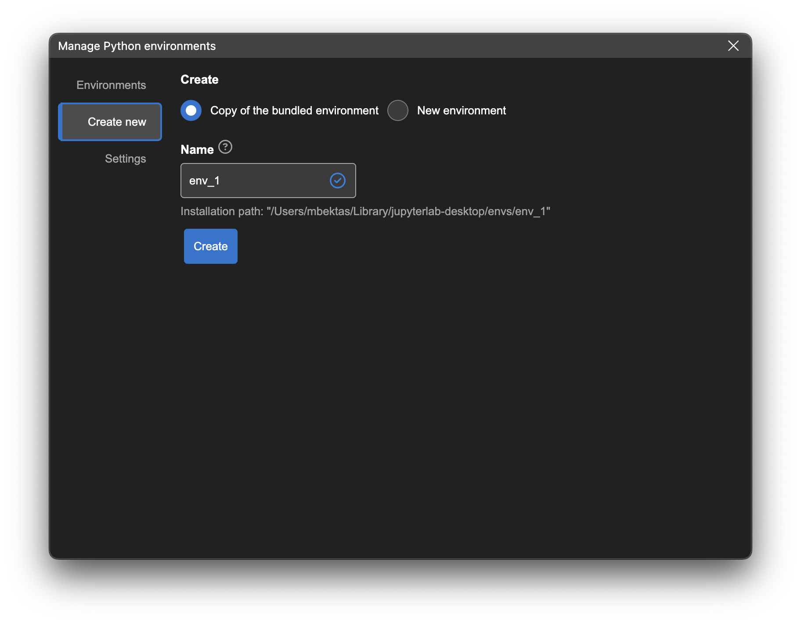
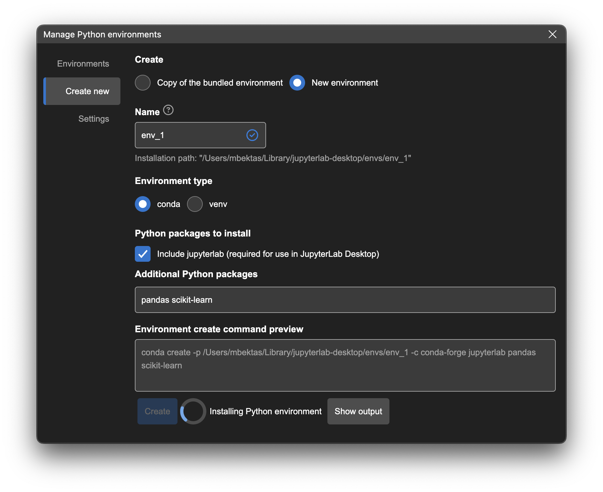

# Python environment management

JupyterLab Desktop (JLD) lets you manage Python environments on your system with a simple and user-friendly UI. You can launch the Python environment management dialog by using the `Hamburger Menu` on top right -> `Manage Python environments` or by clicking the gear icon on session environment selection popup. (Note: You can also manage Python environments using JLD CLI (jlab), which comes with additional environment create options. See [this section](#python-environment-management-using-cli) for CLI commands to manage environments.)




In this dialog Python environments on your system, discovered by the app will be listed. You can create new environments, add existing environments and configure Python environment settings on this dialog.



`Environments` tab lists your existing environments that are compatible with JLD. You can launch a Terminal with the selected environment activated, browse the environment installation directory and access to other actions on the environment by using the environment menu on the right of each environment row. Environments installed by the app and which are currently not in use, can be deleted by using the Delete menu item in this environment menu.

If an environment on your system was not discovered, you can still add it using the `Add existing` button. Simply select the Python executable (`python.exe` on Windows and `python` on macOS & Linux) of the custom environment you would like to use. Python executable can be found at the root directory of the virtual environment on Windows and in the `bin` directory of the environment on macOS & Linux. JLD will validate the environment for compatibility. Note that `jupyterlab` Python package must be installed in a Python environment to be compatible with JLD.

You can create new Python environments in the `Create new` tab. New environments can be created by using the bundled environment installer (`Copy of the budled environment` option) or by downloading packages from registry (`New environment` option).

When creating the copy of the bundled environment, just enter a name for your environment and click the Create button. Bundled environment will be installed into the directory shown on the dialog.



When creating new environments from registry you can choose the type of the environment (conda or venv) and enter additional packages to install. Once you click the Create button, packages will be downloaded from the registry based on your selections and installed. You can see the progress of the installation by clicking the `Show output` button.



Once the installation is finished, newly created environments are automatically added to JLD environment registry, making them ready to use with the app.

You can manage the Python environment settings in the `Settings` tab. Here you can set the default Python environment for JupyterLab Server instances launched by JLD, set the new environment installation directory and other options related to new environment creation and server launch. When there are updates available for bundled environment installation, you will see a notification on this tab as well.


# Python environment management using CLI

JupyterLab Desktop CLI (`jlab`) provides several commands and options to manage Python environments for use in the application. Below is the list of environment management commands.

### `jlab env info`

Show app's Python environment configuration such as bundled Python environment installation path and default Python environment path.

### `jlab env list`

List Python environments available to the app. These are the environments discovered by the app or set by user.

### `jlab env create`

Install or update the bundled Python environment. Environment is installed into the [default installation path](troubleshoot.md#Installation-Paths). If there is an existing installation and/or you would like to update the environment set the `--force` argument to replace the existing installation.

Examples:

```bash
# install bundled environment to default directory
jlab env create
# update bundled environment installation
jlab env create --force
```

### `jlab env create [--name=<name>] [--prefix=<path>] [--source=<source>] [--source-type=<source-type>] [--channel=<channels>] [--env-type=<env-type>] [--add-jupyterlab-package=<value>] [package list]`

Create a new Python environment. If the `--name` argument is set, then the environment is created under Python [environment install directory](troubleshoot.md#Installation-Paths). If the `--prefix` (directory path) argument is provided, then the environment is installed into the specified directory. Created environment is automatically added to app's environments list to allow selection on the UI. If there is an existing installation at the resolved location, `--force` argument can be set to overwrite.

Options:

**--name**: Environment name and directory name for installation under `<application-data-dir>/envs/` directory.

**--prefix**: Environment installation directory path. If `--name` and `--prefix` are both set `--prefix` is discarded.

**--source**: Installation source. Valid values are `bundle`, `<file-path>`, `<url>`, `""`. Default is empty string (`""`).

**--source-type**: Installation source type. Valid values are `conda-pack`, `conda-lock-file`, `conda-env-file`, `registry`. Default is `registry`. When source is set to `bundle` then source-type automatically becomes `conda-pack`.

**--channel**: List of custom conda channels to use when installing new conda packages. By default, conda channels from user settings are used. You can use `jlab env info` to see default conda channels.

**--env-type**: Environment type to create. Valid values are `conda`, `venv` and `auto`. Default is `auto`. If it is set to `auto`, `conda` will be used if a conda based --source-type is set or if conda executable is found in the system.

**--add-jupyterlab-package**: Flag to automatically add `jupyterlab` Python package to the package list. `jupyterlab` package is required for an environment to be compatible with JupyterLab Desktop. Default is `true`. This flag has no effect when source is `bundle` since bundle already contains jupyterlab package.

**[package list]**: List of (additional) packages to install to the environment. If the source-type is not registry, this package list is installed after the source is installed.

### Examples:

### Creating new environments using the bundled installer

See [env_installer/jlab_server.yaml](env_installer/jlab_server.yaml) for the list of packages in the bundled installer.

```bash
# install bundled environment to <application-data-dir>/envs/test-env
jlab env create --name=test-env --source=bundle
# install bundled environment to /opt/jlab_server
jlab env create --prefix=/opt/jlab_server --source=bundle
# install bundled environment to /opt/jlab_server overwriting any existing installation
jlab env create --prefix=/opt/jlab_server --source=bundle --force
# install bundled environment to <application-data-dir>/envs/test-env and add scikit-learn package
jlab env create --name=test-env --source=bundle scikit-learn
```

### Creating new environments using packages from registry

```bash
# create environment with jupyterlab only
jlab env create -n test-env
# create environment with scikit-learn and jupyterlab
jlab env create -n test-env scikit-learn
# create environment with biocode and jupyterlab, using custom conda channels
jlab env create -n test-env --channel conda-forge bioconda -- biocode
# create a venv (using pip) environment with jupyterlab
jlab env create -n test-env --env-type=venv
```

### Creating new environments using conda environment files

See [conda documentation](https://docs.conda.io/projects/conda/en/latest/user-guide/tasks/manage-environments.html#create-env-file-manually) for more information on conda environment files.

```bash
# create environment using local environment file
jlab env create -n test-env --source=/opt/env.yaml --source-type=conda-env-file
# create environment using local environment file and add scikit-learn
jlab env create -n test-env --source=/opt/env.yaml --source-type=conda-env-file scikit-learn
# create environment using online environment file
jlab env create -n test-env --source=https://example.org/conda-env/env.yaml --source-type=conda-env-file
# create environment using online environment file and disable automatically adding jupyterlab package (assuming jupyterlab is already in the yaml)
jlab env create -n test-env --source=https://example.org/conda-env/env.yaml --source-type=conda-env-file --add-jupyterlab-package=false
```

### Creating new environments using conda lock files

See [conda-lock documentation](https://conda.github.io/conda-lock/) for more information on conda lock files.

```bash
# create environment using local conda lock file
jlab env create -n test-env --source=/opt/env-lock.lock --source-type=conda-lock-file
# create environment using local conda lock file and add scikit-learn
jlab env create -n test-env --source=/opt/env-lock.yaml --source-type=conda-lock-file scikit-learn
# create environment using online conda lock file
jlab env create -n test-env --source=https://example.org/conda-env/env-lock.lock --source-type=conda-lock-file
# create environment using online conda lock file and disable automatically adding jupyterlab package (assuming jupyterlab is already in the lock file)
jlab env create -n test-env --source=https://example.org/conda-env/env-lock.yaml --source-type=conda-lock-file --add-jupyterlab-package=false
```

### Creating new environments using conda pack bundle files

See [conda-pack documentation](https://conda.github.io/conda-pack/) for more information on conda pack bundles.

```bash
# create environment using local conda pack file
jlab env create -n test-env --source=/opt/env.tar.gz --source-type=conda-pack
# create environment using local conda pack file and add scikit-learn
jlab env create -n test-env --source=/opt/env.tar.gz --source-type=conda-pack scikit-learn
# create environment using online conda pack file
jlab env create -n test-env --source=https://example.org/conda-env/env.tar.gz --source-type=conda-pack
# create environment using online conda pack file and disable automatically adding jupyterlab package (assuming jupyterlab is already in the bundle)
jlab env create -n test-env --source=https://example.org/conda-env/env.tar.gz --source-type=conda-pack --add-jupyterlab-package=false
```

### `jlab env activate [--name=<name>] [--prefix=<prefix>]`

Activate a Python environment in system terminal. In order to activate app's default Python environment, skip the name and prefix arguments.

Examples:

```bash
# activate the default Python environment
jlab env activate
# activate the Python environment at /opt/jlab_server
jlab env activate /opt/jlab_server
# activate ml-env in <application-data-dir>/envs/ directory by name
jlab env active ml-env
# activate ml-env in <application-data-dir>/envs/ directory by name
jlab env active --name=ml-env
# activate ml-env by prefix path
jlab env active /opt/envs/ml-env
# activate ml-env by prefix path
jlab env active --prefix=/opt/envs/ml-env
```

Make sure to exit the terminal process when you are done with activated environment, by running `exit` command.

### `jlab env update-registry`

Update discovered and user set Python environments without launching UI. This command resolves the environment details using the paths stored in app's environment registry. This operation is automatically done at app launch but the command can be used to do the same without launching the app.

### `jlab env set-python-envs-path <path>`

Set Python environment install directory.

Examples:

```bash
# set environment install directory to /opt/python_envs
jlab env set-python-envs-path /opt/python_envs
```

### `jlab env set-conda-path <path>`

Set base conda executable path. Base conda executable is used to when creating new conda environments, and running conda commands.

Examples:

```bash
# set conda path to /opt/base_conda/bin/conda
jlab env set-conda-path /opt/base_conda/bin/conda
```

### `jlab env set-conda-channels <channel list>`

Set conda channels (separated by space) to use when installing new conda packages.

Examples:

```bash
# set conda channels to [conda-forge, bioconda]
jlab env set-conda-channels conda-forge bioconda
```

### `jlab env set-system-python-path <path>`

Set Python executable path to use when creating new venv environments

Examples:

```bash
# set python path to /opt/python3.12/bin/python
jlab env set-system-python-path /opt/python3.12/bin/python
```

## Command argument aliases

Below are the shorthand aliases for some of the arguments

- `-n` for `--name`
- `-p` for `--prefix`
- `-c` for `--channel`
