# Troubleshooting JupyterLab Desktop

Understanding how JupyterLab Desktop (JLD) works will greatly help in troubleshooting issues. Check out the [How JupyterLab Desktop works section in User Guide](user-guide.md#How-JupyterLab-Desktop-works) first.

Below are detailed information on topics which commonly come up in questions and issues reported about JupyterLab Desktop. Please read through the topics relavant to the issues you are experiencing. You might be able to resolve the issues on your own.

- [JupyterLab Desktop vs JupyterLab Web Application versions](#JupyterLab-Desktop-vs-JupyterLab-Web-Application-versions)
- [JupyterLab Desktop vs JupyterLab Web Application settings](#JupyterLab-Desktop-vs-JupyterLab-Web-Application-settings)
- [Settings locations and resetting](#Settings-locations-and-resetting)
- [Getting Python environment information for a session](#Getting-Python-environment-information-for-a-session)
- [Logs](#Logs)
- [Dealing with custom environment server launch errors](#Dealing-with-custom-environment-server-launch-errors)
- [Launching JupyterLab Server manually](#Launching-JupyterLab-Server-manually)
- [Installation Paths](#Installation-Paths)
- [Theme persistence issues](#Theme-persistence-issues)
- [After JupyterLab Desktop update, why there is still the old JupyterLab Web Application version?](#after-jupyterlab-desktop-update-why-there-is-still-the-old-jupyterlab-web-application-version)
- [macOS write permission issues](#macOS-write-permission-issues)
- [Windows uninstall issues](#Windows-uninstall-issues)
- [Double clicking .ipynb files not launching JLD](#double-clicking-ipynb-files-not-launching-jld)
- [Detecting if an issue is specific to JupyterLab Desktop or not](#Detecting-if-an-issue-is-specific-to-JupyterLab-Desktop-or-not)
- [Debugging application launch issues](#Debugging-application-launch-issues)
- [Reverting to an older version and disabling auto-update](#Reverting-to-an-older-version-and-disabling-auto-update)
- [`Delete` environment menu item availability in Manage Python environments dialog](#delete-environment-menu-item-availability-in-manage-python-environments-dialog)
- [Recommended ways to install additional Python packages](#recommended-ways-to-install-additional-python-packages)
- [Why a setting change on Settings dialog is not applied to a project?](#why-a-setting-change-on-settings-dialog-is-not-applied-to-a-project)
- [Additional resources on JupyterLab Desktop](#additional-resources-on-jupyterlab-desktop)

## JupyterLab Desktop vs JupyterLab Web Application versions

When a new version of JLD is released, it comes with a bundled Python environment installer. The jupyterlab Python package version in that installer is the same as the desktop app version except for the suffix part. For example JLD version 3.6.3-1 bundles jupyterlab Python package version 3.6.3. JLD version 3.6.3-2 also bundles the same version of jupyterlab (3.6.3). This allows releasing new versions of JLD even if the jupyterlab version stays the same.

You can see the version of the JLD by going to Desktop app menu (Hamburger menu on top right) -> About dialog.

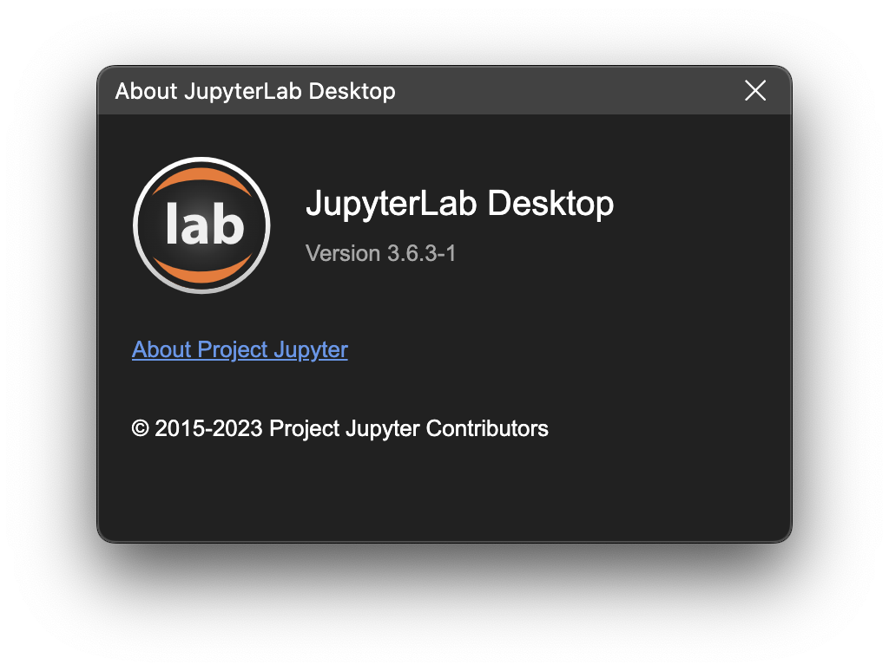

The version of the JupyterLab Web Application can be seen either by hovering over the title bar area that shows the environment info on top right, or by opening the About dialog of JupyterLab UI (Help menu -> About).

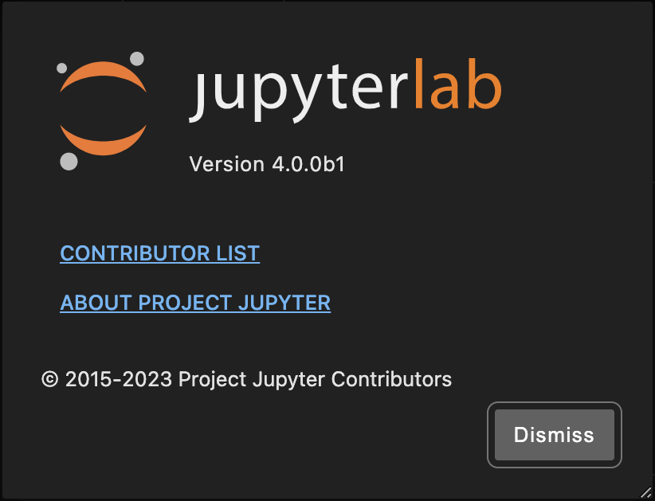

JLD is compatible with a wide range of jupyterlab Python package versions (>=3.0.0). So, any custom Python environment with jupyterlab package version >= 3.0.0 can be used in JLD.

## JupyterLab Desktop vs JupyterLab Web Application settings

JupyterLab Desktop loads JupyterLab Web Application UI in embedded browser. They have different settings except for theme setting which can be synced from JLD settings to web app settings. JLD settings are accessed from the hamburger menu on top right of a session window. Web app settings are accessed from the Settings menu shown in the embedded browser view's top section.

JLD settings are applicable to all sessions. Since JupyterLab Web Application stores settings per user, they are also applied to all sessions, even if they have different Python environments and jupyterlab versions. However, different Python environments can have different JupyterLab extensions installed.

JLD by default stores workspace configuration (layout of UI, open tabs) per project.

## Settings locations and resetting

JLD stores user settings, project settings and application data in different locations as JSON files. You can see [configuration and data files section in User Guide](user-guide.md#Configuration-and-data-files) for the locations in different systems. It is safe to delete these files or keys in these files to reset specific configurations.

## Getting Python environment information for a session

If you would like to access the details of the Python environment used by a session, you can hover on the Server information label shown on the title bar. You will see the session information summary as shown below which includes JupyterLab server information, working directory root, Python environment type & Python executable path, Python and JupyterLab Python package versions. In order to list all of the Python packages in the current Python environment, you can run `pip list` in a JupyterLab Terminal.

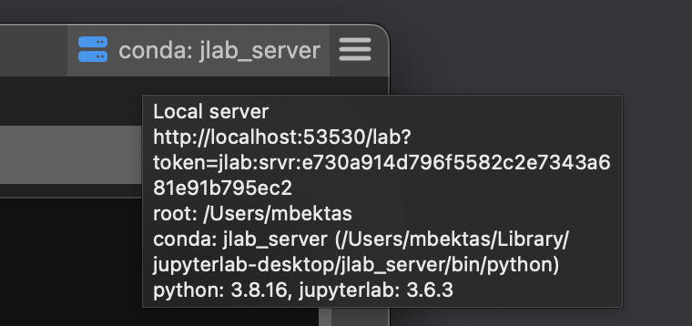

## Logs

JupyterLab Desktop saves logs in the following locations. Information about crashes, warnings and additional information might be available in logs. For troubleshooting purposes, it is recommended to set log level to Debug.

- On Windows: `%APPDATA%\jupyterlab-desktop\logs\main.log`
- On macOS `~/Library/Logs/jupyterlab-desktop/main.log`
- On Linux: `~/.config/jupyterlab-desktop/logs/main.log` or `$XDG_CONFIG_HOME/jupyterlab-desktop/logs/main.log`

You can change the log level from the Settings dialog. Setting log level to `Debug` will provide most detailed logs, while setting to `Error` will configure the app to log only when errors occur. Changing log level requires application restart.

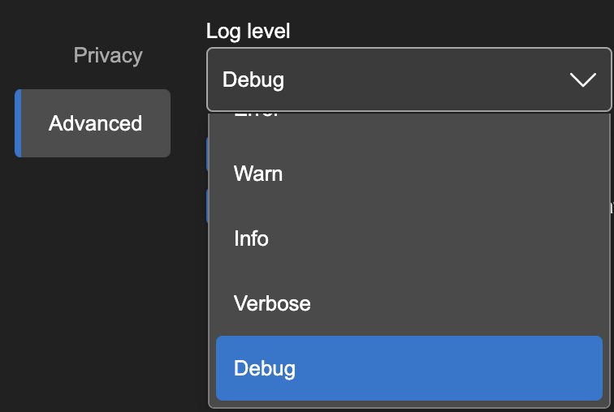

Log level can also be set using CLI or by specifying in `settings.json` file. In order to set log level temporarily via CLI, run the jlab CLI command with parameter `--log-level` as shown below. Checkout `jlab --help` for all log level options and other CLI parameters.

```bash
jlab --log-level debug
```

In order to set log level via `settings.json` file, add the `logLevel` key with the level value as shown below.

```json
{
  "logLevel": "debug"
  // ...other settings
}
```

## Dealing with custom environment server launch errors

As mentioned in [how the desktop application works](user-guide.md#how-the-desktop-application-works) section, JupyterLab Desktop requires jupyterlab (>=3.0.0) Python package in the Python environment selected. JupyterLab Desktop launches a new JupyterLab server instance locally using the jupyterlab Python package. A common reason for server launch errors is missing this Python package.

You can easily install jupyterlab Python package to a custom environment by using the following command after activating the environment in a system Terminal. (See [instructions here](user-guide.md#How-to-create-a-Custom-Python-Environment) for creating a custom Python environment)

```bash
pip install jupyterlab
```

Running the following command shows if the package is available and its version if installed.

```bash
pip show jupyterlab
```

Server launch errors are usually saved in application logs. Please check the logs section above to inspect logs for launch errors.

Note that JupyterLab Desktop currently supports venv and conda Python environments. Other environments such as `mamba` are not tested.

Another way to debug server launch errors is by trying to launch JupyterLab by using system Terminal and using the same launch parameters as the desktop app. Follow these steps below to do that.

### Launching JupyterLab Server manually

You can launch JupyterLab web app using the same Python environment by following the steps below.

1. Go to Manage Python environments dialog and open the environment menu by clicking the button on the right end of the row.
2. Click `Launch Terminal` menu item. This will open a system terminal and activate the Python environment.
3. Run `jupyter lab` command in the terminal. This will launch JupyterLab web app and open it on your default browser. Check the terminal output for errors and/or warnings.

If you would like to launch the web app with the same parameters as the desktop app then follow the steps below.

1. Go to Settings dialog in desktop app and open the `Server` tab.
2. Server tab shows `Server launch command preview` as shown below. Copy the command to clipboard.

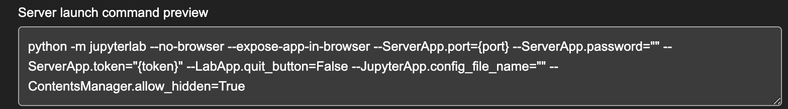

3. Activate the custom Python environment you would like to debug on a system terminal. You can use the Manage Python environments dialog as described above.
4. Run the command copied from the preview after replacing `{port}` with a value like `8888` and `{token}` with a value like `abcde`.
5. Check the Terminal output for errors and/or warnings.

## Installation Paths

JLD installers use the following paths for application and bundled Python environment installation. It is recommended to use these default paths. However, if these paths resolve to absolute paths that have spaces and / or special characters on your system, then you need to use a different path. Conda environments don't work properly if they are installed to paths that have spaces in them.

Application install paths:

- On Windows: `C:\JupyterLab\`
- On macOS: `/Applications/JupyterLab.app`
- On Linux: `/opt/JupyterLab`

Bundled Python environment installers are located in:

- On Windows: `C:\JupyterLab\resources\env_installer`
- On macOS: `/Applications/JupyterLab.app/Contents/Resources/env_installer`
- On Linux: `/opt/JupyterLab/resources/env_installer`

Bundled Python environment is installed to:

- On Windows: `%APPDATA%\jupyterlab-desktop\jlab_server`
- On macOS: `~/Library/jupyterlab-desktop/jlab_server`
- On Linux: `~/.config/jupyterlab-desktop/jlab_server`

New Python environment install paths:

- On Windows: `%APPDATA%\jupyterlab-desktop\envs`
- On macOS: `~/Library/jupyterlab-desktop/envs`
- On Linux: `~/.config/jupyterlab-desktop/envs`

## After JupyterLab Desktop update, why there is still the old JupyterLab Web Application version?

Updating JLD application doesn't automatically update the Python environment previously used by the application, for various reasons. However, bundled Python environment installer is updated if the new JLD has a version upgrade other than suffix (`-n`) change. You can compare the versions of JLD application and jupyterlab package versions in the Python environment as described in [versions section above](#jupyterlab-desktop-vs-jupyterlab-web-application-versions).

JLD shows a notification badge on the title bar as shown below when there is an update available for the bundled environment installation. Clicking on the session info button will open up the environment selection popup and there will be an orange server button to let you update the bundled environment installation with one click.

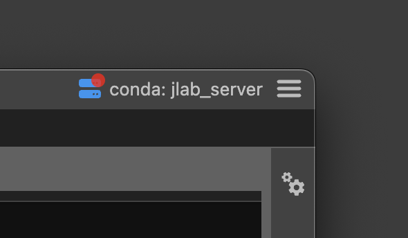 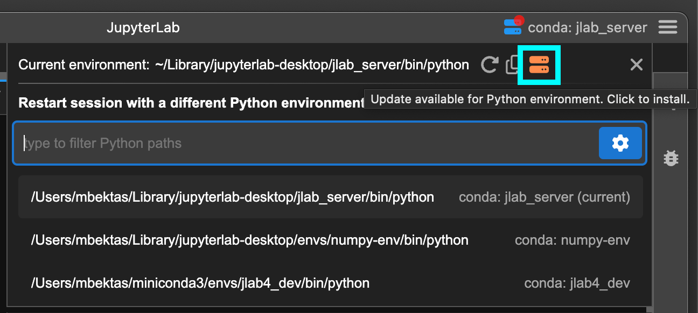

You can customize the update settings in the `Settings` dialog -> `Advanced` tab. You can configure JLD to update the bundled environment installation automatically when a new version of JLD is installed. Simply check the `Update bundled environment automatically when app is updated` option in the settings. Note that this will delete the existing bundled environment installation and then install a fresh new version.

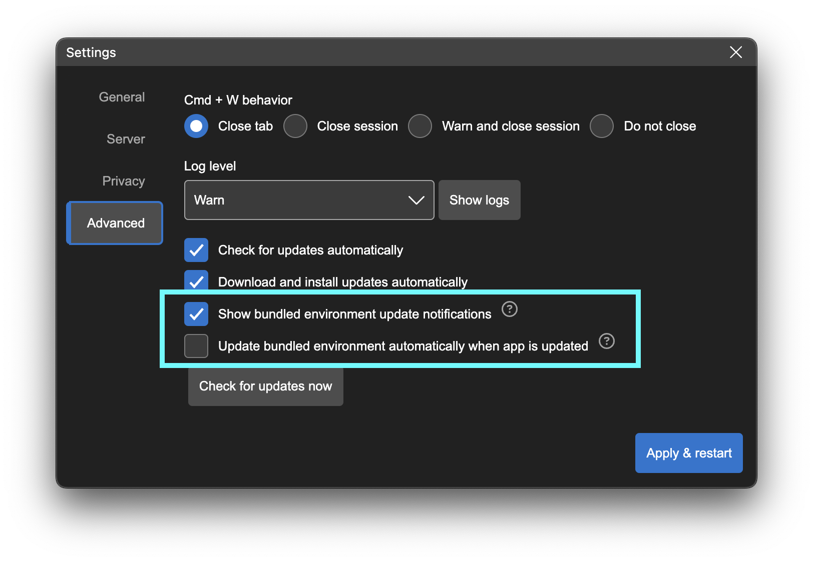

You can update the bundled Python environment installation also on Python environment management dialog manually. Go to `Hamburger Menu` -> `Manage Python environments` -> `Settings` tab. If your bundled Python environment installation is out-dated then you will see a notification and a button to update the installation.

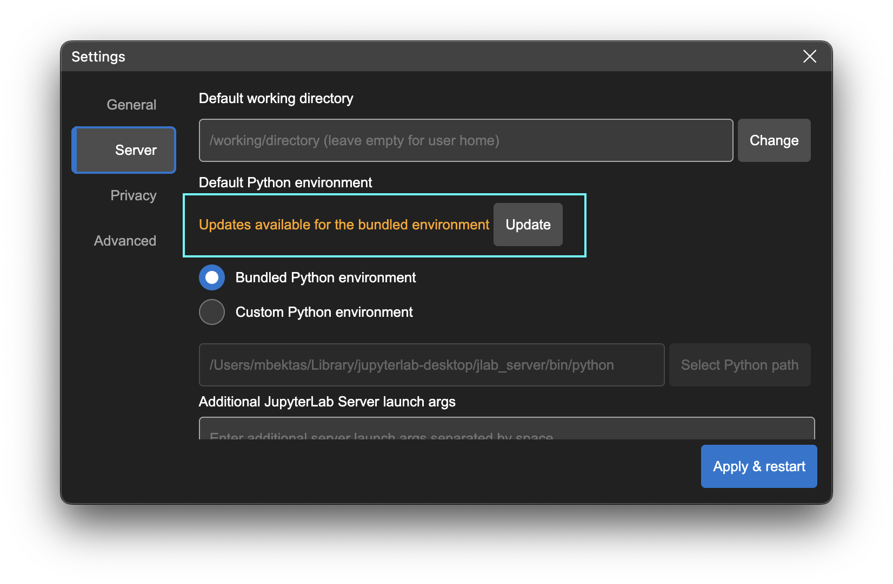

Another way to update the bundled Python environment installation by using the CLI command below as well. Make sure to stop all running JLD instances before running the command. It will first remove the existing installation and then reinstall the environment.

```bash
jlab env create --force
```

## macOS write permission issues

On macOS, bundled Python environment is installed into a non user data directory (`~/Library/jupyterlab-desktop/jlab_server`) due to conda environment path limitations. Make sure that you have write permissions to `~/Library` directory. If you are having issues with bundled Python environment in macOS, check that environment is properly installed in there. If `~/Library/jupyterlab-desktop/jlab_server/bin/python` file exists and you can manually launch Python by using this path on a macOS Terminal, then your bundled Python environment installation was successful.

JLD installers for Windows and Linux create `jlab` CLI command as part of the installation process. However, macOS application creates this command at first launch and after updates. This command creation might sometimes fail if the user doesn't have the right permissions. This command is created as a symlink at `/usr/local/bin/jlab`. The symlink points to `/Applications/JupyterLab.app/Contents/Resources/app/jlab` script that launches the desktop application. If you are having issues with running `jlab` command on macOS, you can try these steps to setup the CLI:

1. Go to Settings dialog from hamburger menu on top right and open the `Advanced` tab.
2. In this tab you will see a section titled `jlab CLI` and the CLI setup status. You can click on the `Setup CLI` button to properly setup the CLI. Clicking the button will run a script to setup the jlab symlink as mentioned above. This action requires admin rights and you may be required to enter your password to continue. The password is required by macOS and not received by the app.

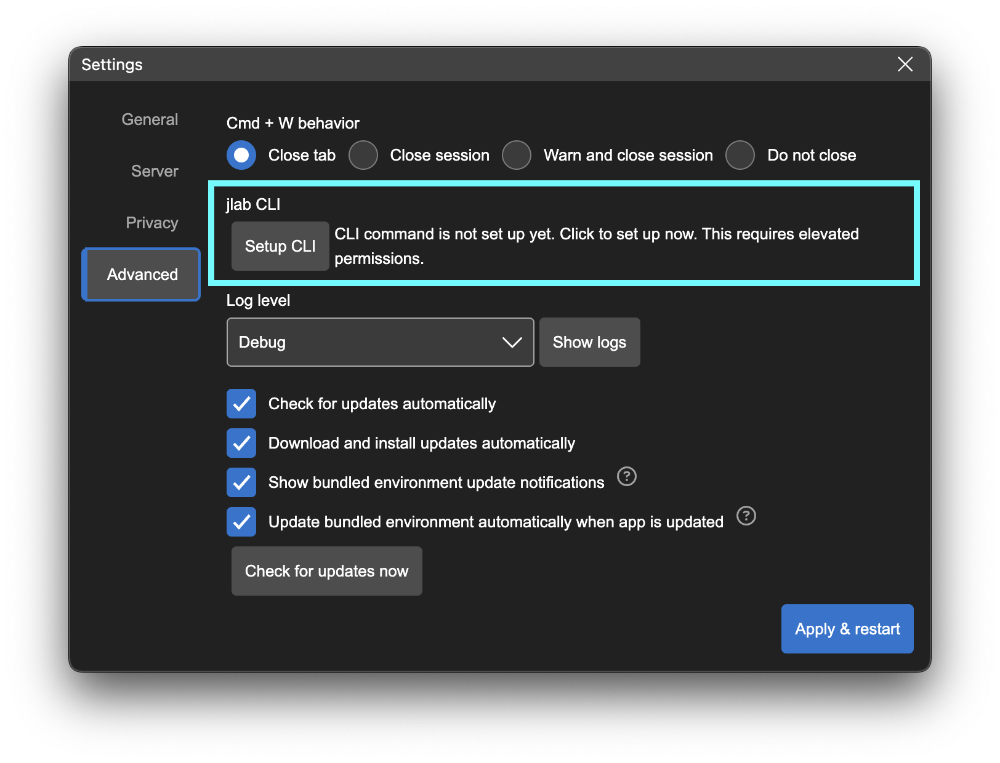 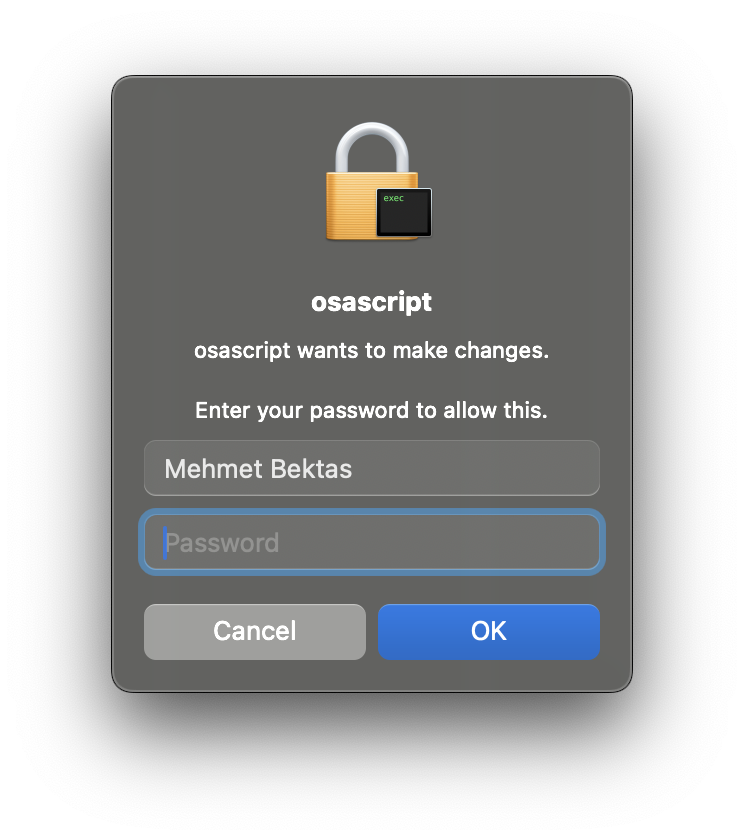

If jlab CLI is setup properly you will see the status below on the Settings dialog.

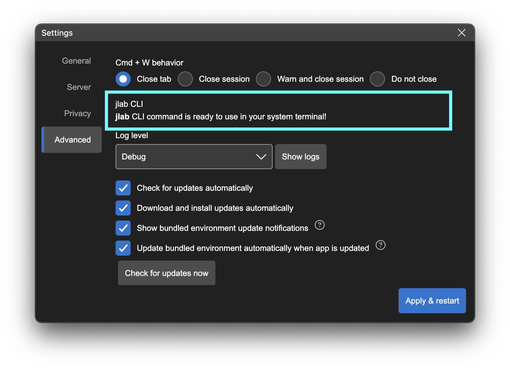

If you are still having issues setting up the CLI with the steps recommended above, try the following:

- Make sure you have write access to `/usr/local/bin/` directory
- If you are still having issues make sure `/Applications/JupyterLab.app/Contents/Resources/app/jlab` is executable. You can run the command below to enable execution.

```bash
chmod 755 /Applications/JupyterLab.app/Contents/Resources/app/jlab
```

- If you get `Operation not permitted` errors with the command above then you will need to allow Terminal to update other applications. In order to do that, go to `Settings` -> `Privacy & Security` -> `App Management` on your macOS and toggle Terminal in the list. Restart Terminal and try the command above again.

## Windows uninstall issues

Since the bundled Python environment is installed into the same directory for all versions, installing and uninstalling multiple versions might leave dangling install metadata in the registry. You can clean these records by following these steps.

1. Make sure no JupyterLab Desktop or server instance is running (rebooting Windows should terminate them if any)
2. If you want to uninstall any existing JupyterLab Desktop and/or Server installation, go to Add / Remove Programs and remove all of the related installations.
3. If there are any dangling installations that cannot be removed from Add / Remove Programs then remove those dangling ones by following [the instructions here](https://support.microsoft.com/en-us/topic/removing-invalid-entries-in-the-add-remove-programs-tool-0dae27c1-0b06-2559-311b-635cd532a6d5) with care.
4. The instructions in the link above may need to be followed also for: HKEY_CURRENT_USER\Software\Microsoft\Windows\CurrentVersion\Uninstall

## Double clicking .ipynb files not launching JLD

JupyterLab Desktop installers automatically associate `.ipynb` files with the application. If you are still having issues with launch by double clicking `.ipynb` files, you can fix it by right clicking the file and changing the default opener. Use the system specific `Open with...` dialog to set JupyterLab Desktop as the default application to open `.ipynb` files with.

## Theme persistence issues

If you are having issues with theme settings check out [Theming section in User Guide](user-guide.md#theming). You may need to turn off synching.

## Detecting if an issue is specific to JupyterLab Desktop or not

Some of the issues are obviously JupyterLab Desktop issues such as inability to launch the application, persisting settings etc. However, we also get issues reported or features requested in this repo for JupyterLab Web Application or other dependency Python libraries. You can check if a problem is specific to Desktop application by testing the same feature in JupyterLab Web Application. You can launch JupyterLab Web Application manually by following the instructions in [Launching JupyterLab Server manually](#Launching-JupyterLab-Server-manually) section.

Another method to launch the web application within the same Python environment is by using the Terminal in JupyterLab Desktop. Just note that this might not always work if you have a bash profile that activates a Python environment on your system by default. Follow these steps to launch the web application from JLD.

1. Open a new Terminal by using `File` -> `New Launcher` menu and then clicking `Terminal` icon in the `Other` section.
2. Run `jupyter lab` command in the Terminal to launch the web application in the external browser.
3. Once you are done testing, make sure to stop JupyterLab by using `Ctrl + C` keys in the Terminal.
4. In order to check if you are using the same Python environment as JLD, you can run `which python` (`where.exe python` on Windows) command in the Terminal.

## Debugging application launch issues

Application launch might fail for various reasons and it is best to check logs for the source of the error. Try the following to debug launch issues.

1. Set log level to `debug` by following the instructions [here](#Logs).
2. Retry launching and check logs.
3. Try removing custom environment settings from `settings.json` and/or `desktop-settings.json`. You can see [configuration and data files section in User Guide](user-guide.md#Configuration-and-data-files) for the locations of these files in different systems. Retry launch and check logs.
4. Try removing application cache data from `app-data.json`. Retry launch and check logs.
5. Try to launch using `jlab --log-level debug` CLI command to check if there are any logs output in system Terminal.

## Reverting to an older version and disabling auto-update

JupyterLab Desktop automatically downloads and installs new versions on some platforms. If newer versions are causing compatibility issues or other problems you can reinstall an older version. Follow the steps below to disable auto-updates, and revert to an older version.

1. Close all running JupyterLab Desktop instances, make sure all processes have stopped.
2. Open your [User settings file](user-guide.md#configuration-and-data-files) and add the settings below.

   ```json
   {
     "checkForUpdatesAutomatically": false,
     "installUpdatesAutomatically": false
   }
   ```

3. Install older version of JupyterLab Desktop from the [Releases](https://github.com/jupyterlab/jupyterlab-desktop/releases/) page.

## `Delete` environment menu item availability in Manage Python environments dialog

In Manage Python environments dialog all the environments discovered by JLD are listed. However, only the environments installed by JLD can be deleted from this dialog and if they are not currently in use by a JupyterLab session. That's why some of the environments will not have the `Delete` environment menu available.

## Recommended ways to install additional Python packages

You can install additional Python packages to any Python environment used by the app. If the environment is a conda environment then you should prefer `conda install` command and if it is a venv environment then you need to use `pip install` command. You can install the package on a notebook using cell magics or from a terminal using CLI commands.

### Installing using cell magics in a notebook

Run the following in a notebook code cell.

- for conda environments
  - `%conda install <package-name> -c conda-forge`. example: `%conda install scikit-learn -c conda-forge`
- for venv environments
  - `%pip install <package-name>`. example: `pip install scikit-learn`

### Installing using system terminal

Go to Manage Python environments dialog and open the environment menu by clicking the button on the right end of the row. Click `Launch Terminal` menu item. This will open a system terminal and activate the Python environment. Run the following commands in the terminal.

- for conda environments
  - `conda install <package-name> -c conda-forge --solver=classic`. example: `conda install scikit-learn -c conda-forge --solver=classic`. Note that classic solver is required due to a bug in conda and the requirement will be removed soon.
- for venv environments
  - `pip install <package-name>`. example: `pip install scikit-learn`

## Why a setting change on Settings dialog is not applied to a project?

JupyterLab Desktop provides user settings which are configurable from the UI using the Settings dialog. However, a subset of these settings can be overridden by the projects (session working directories). The overridden settings are currently not shown in the UI. If you have project overrides to settings then changes on Settings dialog would not be reflected since project overrides have precedence.

You can use the CLI commands to list and change project setting overrides. See [jlab config commands](cli.md#jlab-config-options) to learn more about CLI commands for project settings. Also see [configuration and data files section in User Guide](user-guide.md#Configuration-and-data-files) for the list of project overridable settings and more details on the app settings.

## Additional resources on JupyterLab Desktop

This repo contains the most up to date documentation on JupyterLab Desktop. However you can refer to the Jupyter blog posts on JLD for more context and information on the application. Below are the links to the blog posts.

- [Python environment management in JupyterLab Desktop (02/20/2024)](https://blog.jupyter.org/python-environment-management-in-jupyterlab-desktop-3b119c5811d9)
- [Introducing the new JupyterLab Desktop! (02/09/2023)](https://blog.jupyter.org/introducing-the-new-jupyterlab-desktop-bca1982bdb23)
- [JupyterLab Desktop — 2022 recap (12/13/2022)](https://blog.jupyter.org/jupyterlab-desktop-2022-recap-28bdf00205c6)
- [JupyterLab Desktop App now available! (09/22/2021)](https://blog.jupyter.org/jupyterlab-desktop-app-now-available-b8b661b17e9a)
