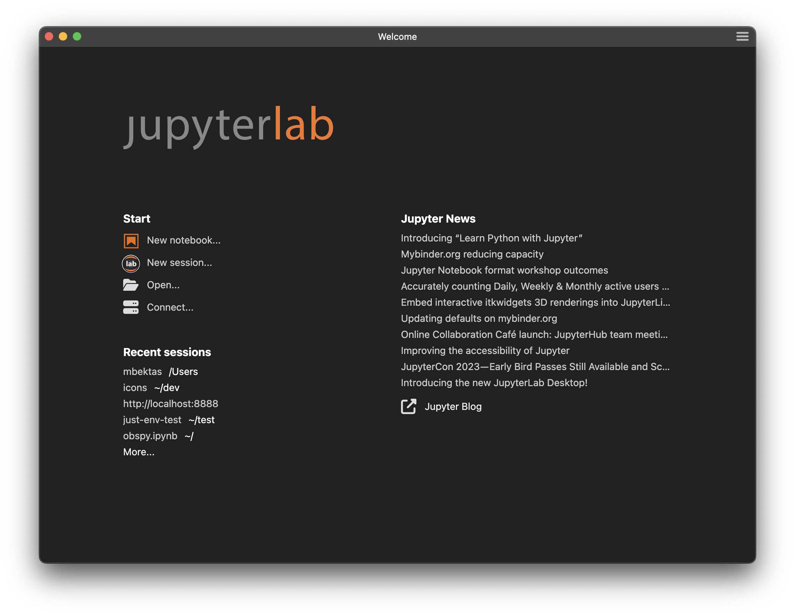
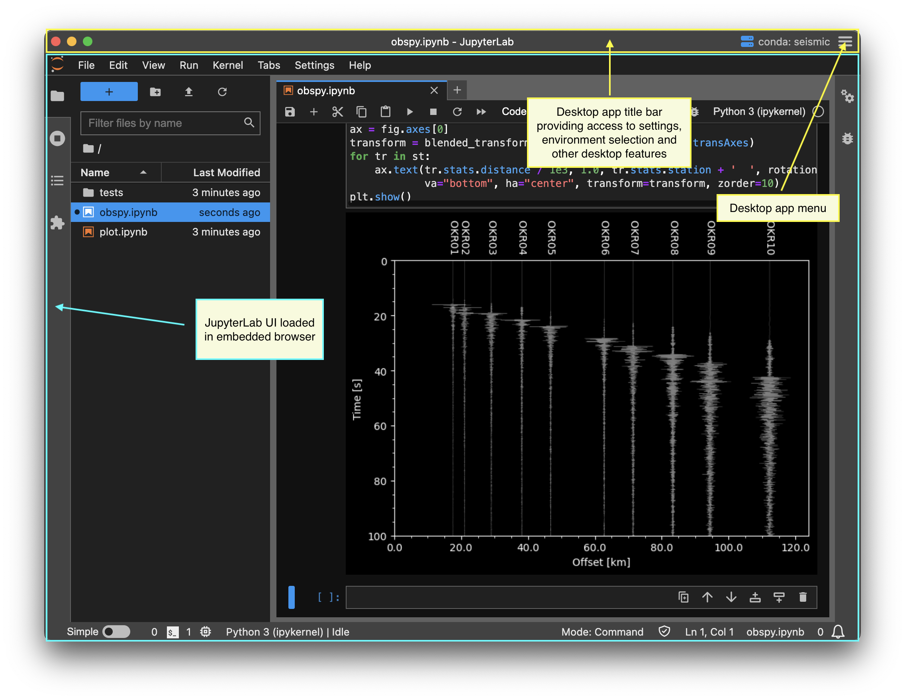
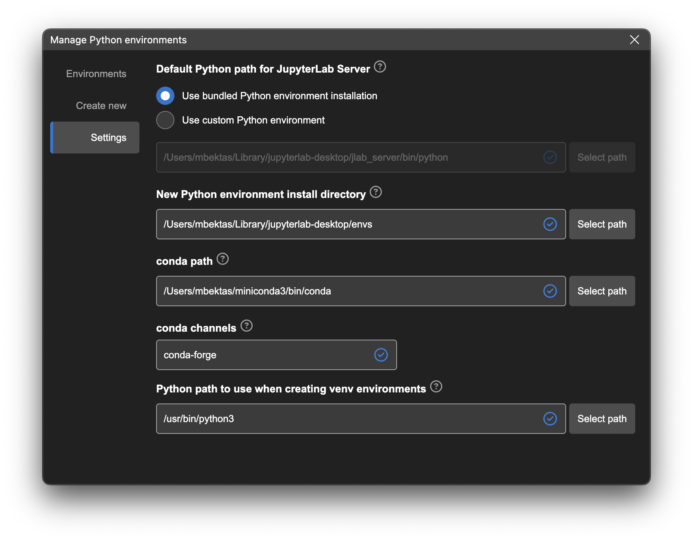
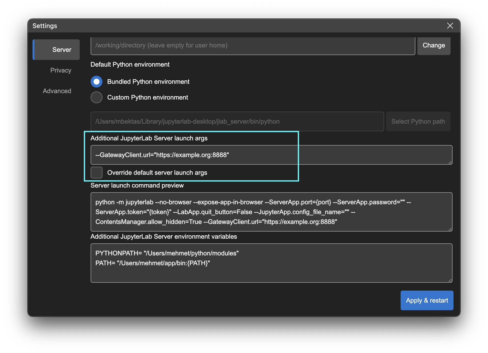
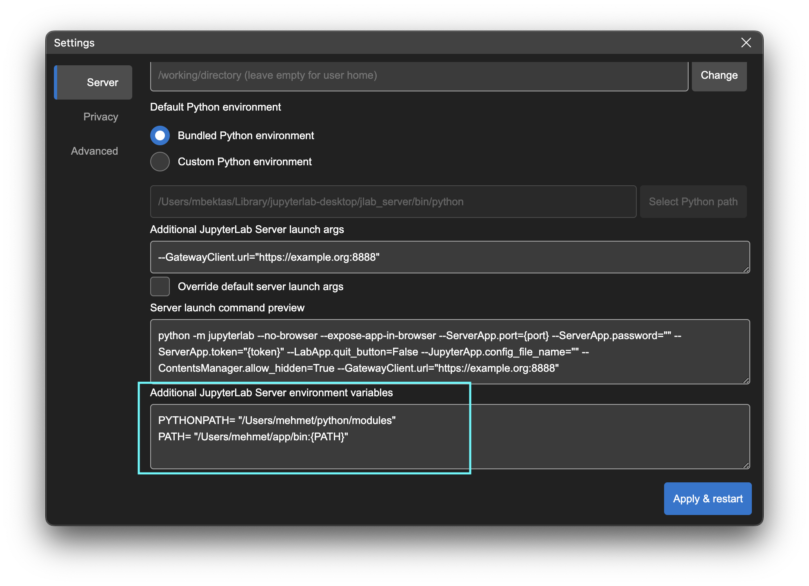
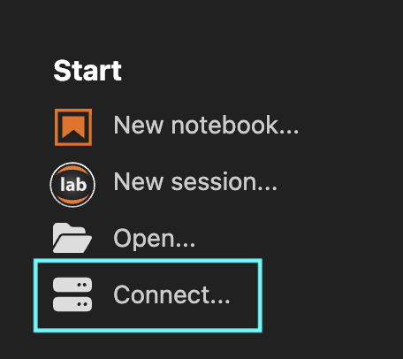
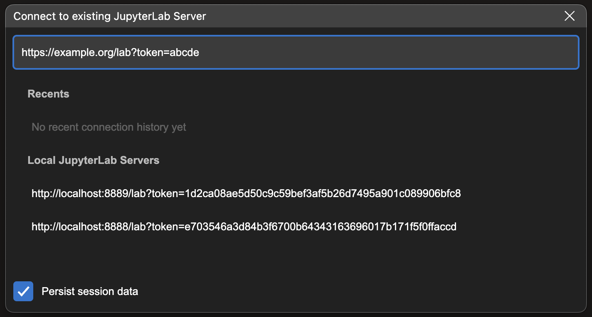
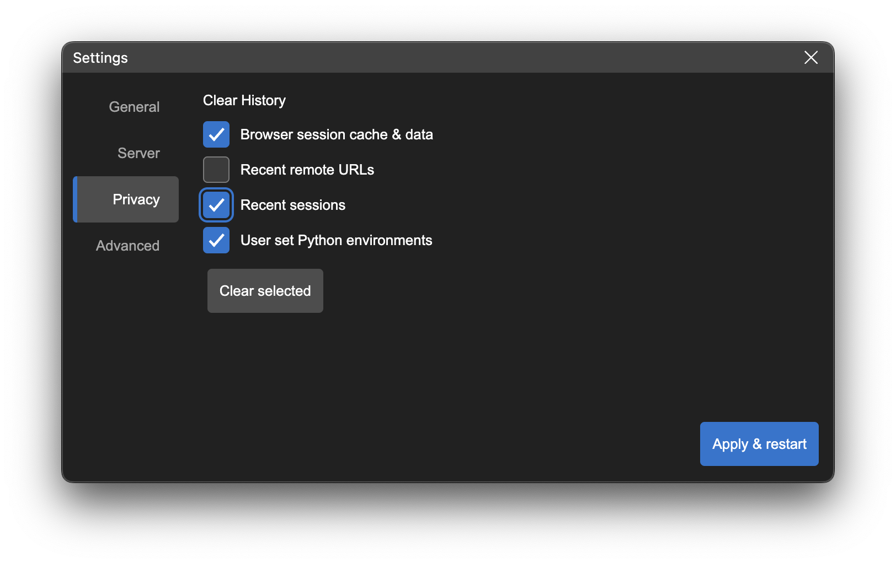
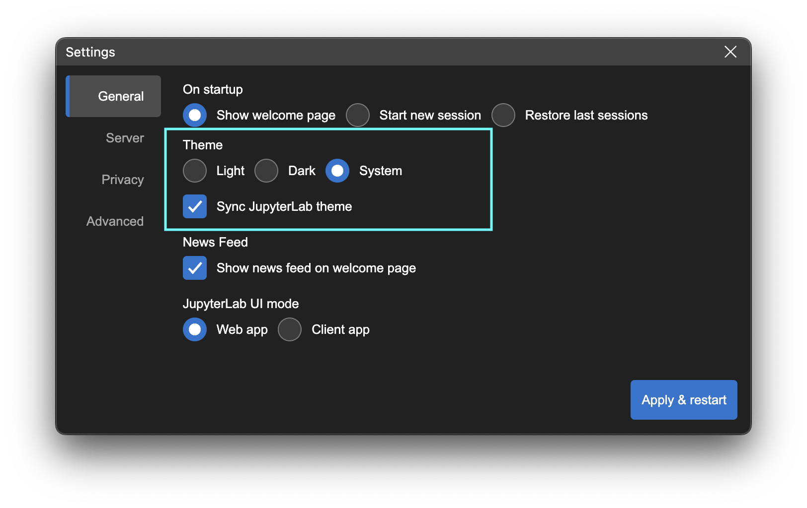

# How JupyterLab Desktop works

JupyterLab Desktop (JLD) is the cross-platform desktop application for [JupyterLab](https://github.com/jupyterlab/jupyterlab). It is the quickest and easiest way to get started with Jupyter notebooks on your personal computer, with the flexibility for advanced use cases. It is bundled with a Python environment that includes jupyterlab Python package and several popular Python libraries ready to use in scientific computing and data science workflows.

## JupyterLab Desktop vs JupyterLab Web Application

The standard distribution of JupyterLab is a Web Application which is available as a Python package named `jupyterlab` and it can be installed using `pip install` and `conda install` commands. Once you install it, you can launch JupyterLab using `jupyter lab` CLI command. When this command is run, JupyterLab server is launched on the computer and the Web Application UI can be accessed from the browser. This setup process requires you to install Python and other scientific computing dependencies manually using Terminal commands. If you are working with multiple Python environments, the process gets more complex for setting up and launching JupyterLab. Opening notebook files on your PC, working with multiple projects in different directories with different Python environments can be challenging for many users when using JupyterLab Web Application directly from CLI.

JupyterLab Desktop makes installing and launching JupyterLab much easier and provides other user friendly features. It comes with one click installers for different operating systems. It still uses the JupyterLab Web Application behind the scenes but it hides the complexities of installation, launch, upgrades and other common tasks. It enables working with different projects in different directories with their own Python environment configuration and UI layout. It keeps a history of previous sessions for easy restore. It also shows a news feed with latest blog posts from Jupyter Blog to keep the users up to date with the Jupyter ecosystem projects. All of these features and more are provided with user friendly GUI, with simple clicks.

When JLD is first launched Users are presented with the Welcome Page. It contains links to several session create options on the left and the Jupyter News feed on the right. The news feed is populated using the Jupyter blog contents and is aimed to keep you up to date with the news and events related to Jupyter ecosystem projects. Clicking on a news item opens the blog post in external browser. This page is only present in the Desktop application and provides user friendly features for desktop integration and working with multiple projects.



JupyterLab Desktop launches JupyterLab server instances in the background for user sessions and displays JupyterLab Web Application UI in an embedded browser. Below is a screenshot of the JLD UI highlighting some of the components critical to understanding the application architecture.



JLD supports multiple session windows. Each session window has a corresponding JupyterLab server process. Users can launch multiple session windows in different directories and for each session they can use a different Python environment. Python environments could have different jupyterlab versions and different set of dependency Python packages.

# Changing the Python Environment used by JupyterLab Desktop

JupyterLab Desktop comes with a bundled Python environment which has the essential Python packages for scientific computing and data science workflows. For more advanced use cases and specific needs, you can set the Python environment used by JupyterLab Desktop to another `conda`, `venv`, or `pyenv` virtual environment available on your computer. The environments on your computer are discovered by JLD on app launch. JLD provides UI and CLI features to let you create new Python environments that are compatible with the app. See [Python environment management](python-env-management.md) for more information.

Active Python environment info is shown on the title bar. If you hover on it you will see the details of the environment such as its path and certain package versions, along with the currently running JupyterLab server instance information.


JupyterLab Desktop allows you to change the default Python environment used for all new sessions and also set project (working directory) specific Python environments.

### To change the default Python environment:

- Open the Manage Python environments dialog from the to right menu and go to the `Settings` tab.



- In Settings tab, select `Use custom Python environment` option and either enter the path to Python executable you would like to use or click `Select path` to browse for it.

- Environment selection will be applied at the next launch of the application

### To set project specific Python environment:

- Click on the server status button on the title bar to launch Python environment selector menu. Compatible Python environments discovered on your computer and any previously used environments will be listed in the menu.


- You can choose from one of the Python paths listed on the menu. You can type in the input field to filter the Python paths in the menu. See [Python environment management](python-env-management.md) for information on adding or creating new Python environments.

- Once you select a new environment, JupyterLab server will be restarted using the new environment without restarting the application.

- Another way to set project specific Python environment is by using the CLI. You can set the `--python-path` CLI parameter (e.g. `jlab --python-path /Users/username/custom_env/bin/python .`) and then the application will launch in the specified project directory with the Python environment set.

Python environment selections are saved in user settings or project settings and restored at launch. See the [Configuration and data files](#Configuration-and-data-files) section for more information about the settings storage. Python environment is stored with `pythonPath` key in those files. Setting the value to empty string or removing the key will reset the change.

# Configuring JupyterLab Server launch

## Server Launch Arguments

JupyterLab Desktop sets several launch arguments when launching the JupyterLab Server instances. Some arguments are fixed and cannot be changed and some default arguments are added to the fixed arguments. Server tab in the settings dialog allows you to add custom arguments and override the default arguments. You can see the preview of the server launch command as you make changes.



## Server Environment Variables

When JupyterLab Server is launched, environment variables are passed from desktop application to the server process. These environment variables depend on how you launched the desktop app (from CLI or via OS GUI). Also note that your Python environment is activated during JupyterLab Server launch and that activation adds additional environment variables and modifies the PATH environment variable for the server process.

You can set additional environment variables for the JupyterLab server process by using the Server tab of the settings dialog, as shown below.

If the environment variable you set already exists, it will be replaced by your setting. `PATH` environment variable is handled specially and you can modify it instead of replacing. You can use existing PATH environment variable in your setting by referring to it as `{PATH}`. This way you can append or prepend to the existing PATH environment variable.



# Connecting to an existing JupyterLab Server

JupyterLab Desktop creates new JupyterLab sessions by launching a locally running JupyterLab server and connecting to it. It can also connect to an existing JupyterLab server instance that is running locally or remotely. In order to connect to a server, click the `Connect...` button in the Start section of the Welcome Page.



This will launch a dialog that automatically discovers and lists the locally running JupyterLab server instances and previously connected local or remote servers in the app history.



Select a server from the list or enter the URL of the JupyterLab application server including `/lab` in the URL. If the server requires a token for authentication, make sure to include it as a query parameter of the URL as well (`/lab?token=<token-value>`). After entering a URL hit `Enter` key to connect.

JupyterLab Desktop can connect to remote server instances that require additional authentication such as Single Sign-On (SSO). If the `Persist session data` option is checked, then the session information is stored and JupyterLab Desktop will re-use this data on the next launch. If this option is not checked, the session data is automatically deleted at the next launch and servers requiring authentication will prompt for re-login.

You can delete the stored session data manually at any time by using the `Clear History` option in the Privacy tab of Settings dialog.



# How to create a Custom Python Environment

### Using conda

```bash
conda create -n custom_venv
conda activate custom_venv
conda install -c conda-forge jupyterlab==3.6.1
# install custom packages
conda install -c conda-forge scikit-learn
```

### Using venv

```bash
python3 -m venv custom_venv
source custom_venv/bin/activate
pip install --upgrade pip
pip install jupyterlab==3.6.1
# install custom packages
pip install scikit-learn
```

# Customizing the Bundled Python Environment

JupyterLab Desktop is a self-contained standalone desktop application which bundles a Python environment. The bundled Python environment comes with several popular Python libraries to make the application ready to use in scientific computing and data science workflows. These packages are `numpy`, `scipy`, `pandas`, `ipywidgets` and `matplotlib`. In order to install additional packages into JupyterLab Desktop's Python environment, you need to follow certain steps during and after the installation as described below.

## Linux Instructions

On Linux, JupyterLab Desktop is installed into `/opt/JupyterLab` and Python environment is created in `~/.config/jupyterlab-desktop/jlab_server`

## macOS Instructions

On macOS, JupyterLab Desktop is installed into `/Applications/JupyterLab` and Python environment is created in `~/Library/jupyterlab-desktop/jlab_server`.

## Windows Instructions

On Windows, there are two installers, one of them is run during initial setup for the main JupyterLab Desktop application and the other one is run when a Python environment needs to be installed. Both of them should be installed to their default install locations. It is `C:\JupyterLab\` for JupyterLab Desktop and `C:\Users\<username>\AppData\Roaming\jupyterlab-desktop\jlab_server` for JupyterLab Desktop Server.

# Installing New Python Packages

Make sure you installed JupyterLab Desktop following the steps outlined above in order to have required permissions to install new Python packages.

- Open a Notebook and run the command below in a cell for the package you want to install. You will see the log of the installation process as the cell output.
  ```bash
  %pip install <package_name>
  ```
  For example: to install scikit-learn
  ```bash
  %pip install scikit-learn
  ```
- In order to use the newly installed package you need to restart your active notebook's kernel or create a new notebook
- If you install a new JupyterLab extension with UI components, then you will need to create a new session for changes to take effect

# Configuration and data files

JupyterLab Desktop stores user settings, project settings and application data in different locations as JSON files. Below are the storage locations and type of data they contain.

- User settings: `{jlab-desktop-user-data-dir}/settings.json`

  This file contains application settings such as default Python path and theme. These settings can be configured from Settings dialog in the application UI.

- Project settings: `{working-directory}/.jupyter/desktop-settings.json`

  This file contains project (working directory) specific overrides of user settings. Currently only `pythonPath` (which is the Python executable path for the Python environment to use for the working directory) setting can be overridden.

- Application data: `{jlab-desktop-user-data-dir}/app-data.json`

  This file contains data used by the application, e.g. recent sessions list, news feed cache, Python environment list cache.

`{jlab-desktop-user-data-dir}` is OS specific and as below

- `%APPDATA%\jupyterlab-desktop` on Windows
- `$XDG_CONFIG_HOME/jupyterlab-desktop` or `~/.config/jupyterlab-desktop` on Linux
- `~/Library/Application Support/jupyterlab-desktop` on macOS

JupyterLab Desktop also uses custom configuration paths for better user experience and to prevent clashes with existing Jupyter installations.

Jupyter config files directory (`JUPYTER_CONFIG_DIR`) is set to `{jlab-desktop-user-data-dir}`. jupyter-server settings, jupyterlab settings, and any other Jupyter configuration are saved to and loaded from this directory. You can change the configuration path by specifying `JLAB_DESKTOP_CONFIG_DIR` environment variable.

JupyterLab workspace data is stored into the working directory, for each folder a new session is started in. This allows restoring open files and UI layout of sessions for different working directories. `{working-directory}/.jupyter/desktop-workspaces` directory is automatically created and used to save and load workspace data for each working directory. You can change this behavior by specifying `JLAB_DESKTOP_WORKSPACES_DIR` environment variable.

## Project settings that can be overridden

JupyterLab Desktop allows a subset of user settings to be overridden by project settings. Below is the list of settings that can be overridden by each project (working directory) with example values.

Example `/.jupyter/desktop-settings.json`

```JSON
{
  "pythonPath" : "/opt/miniconda/env/bin/python",
  "serverArgs": "--GatewayClient.url=\"https://example.org:8888\"",
  "overrideDefaultServerArgs": true,
  "serverEnvVars": {
    "PYTHONPATH": "/opt/dev/pythonmodule",
    "SERVICE_API": "https://service.example.org:9999/api"
  }
}
```

## Copying configuration from previous installation

You can transfer settings from previous JupyterLab installations into JupyterLab Desktop by copying them over to the new configuration path `{jlab-desktop-user-data-dir}` by following these steps:

1. Run `jupyter --paths` to determine where your `config` is stored.
2. Find directory called `lab` in one of these paths.
3. If there is a `user-settings` directory in `lab`, you can copy the `lab` directory over to the configuration path `{jlab-desktop-user-data-dir}` of JupyterLab Desktop to keep your old JupyterLab settings.

**Warning**: If you copy over settings from an older major version of JupyterLab (e.g. 2.x) those might cause an error on startup. Similarly, if you copy settings from a newer (major or minor) version you may see errors.

# Theming

JupyterLab Desktop supports light and dark themes for the application interface. In the settings dialog you can choose `Light`, `Dark` or `System` options to set the desired theme as shown below. `System` option detects the theme used by your OS and sets that as the app theme.

The themes for the JupyterLab UIs shown in the session windows are controlled separately. If you choose `Sync JupyterLab theme` option in the settings dialog then the app theme chosen is applied to the JupyterLab UIs as well but they correspond to `JupyterLab Light` and `JupyterLab Dark` themes. If you would like to use a theme other than `JupyterLab Light` or `JupyterLab Dark` then you need to uncheck the `Sync JupyterLab theme` option.



# Uninstalling JupyterLab Desktop

## Debian, Ubuntu Linux

```bash
sudo apt-get purge jupyterlab-desktop # remove application
rm /usr/bin/jlab # remove command symlink

# to remove application cache and bundled Python environment
rm -rf ~/.config/jupyterlab-desktop
```

## Red Hat, Fedora, SUSE Linux

```bash
sudo rpm -e jupyterlab-desktop # remove application
rm /usr/bin/jlab # remove command symlink

# to remove application cache and bundled Python environment
rm -rf ~/.config/jupyterlab-desktop
```

## macOS

Find the application installation `JupyterLab.app` in Finder (in /Applications or ~/Applications) and move to Trash by using `CMD + Delete`. Clean other application generated files using:

```bash
rm /usr/local/bin/jlab # remove command symlink

# to remove application cache and bundled Python environment
rm -rf ~/Library/jupyterlab-desktop
# to remove user data
rm -rf ~/Library/Application\ Support/jupyterlab-desktop
# to remove logs
rm -rf ~/Library/Logs/jupyterlab-desktop
```

## Windows

On Windows, JupyterLab Desktop is installed in two parts, one for the python environment and another for the application itself. Go to `Windows Apps & Features` dialog using `Start Menu` -> `Settings` -> `Apps` and make sure to uninstall the components in the following order:

- First uninstall JupyterLab Desktop python environment (if applicable, for version v4.0.1-1 and older)


- Then uninstall JupyterLab Desktop application


In order to remove application cache, delete `%APPDATA%\jupyterlab-desktop` directory.
