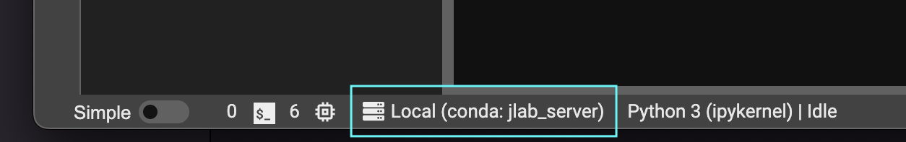
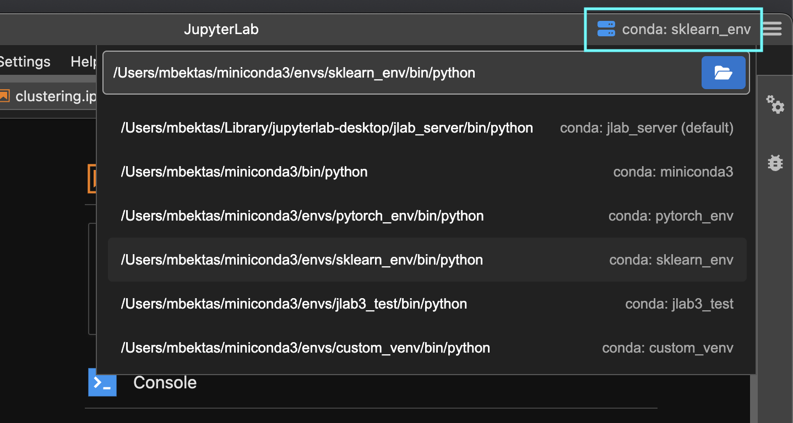
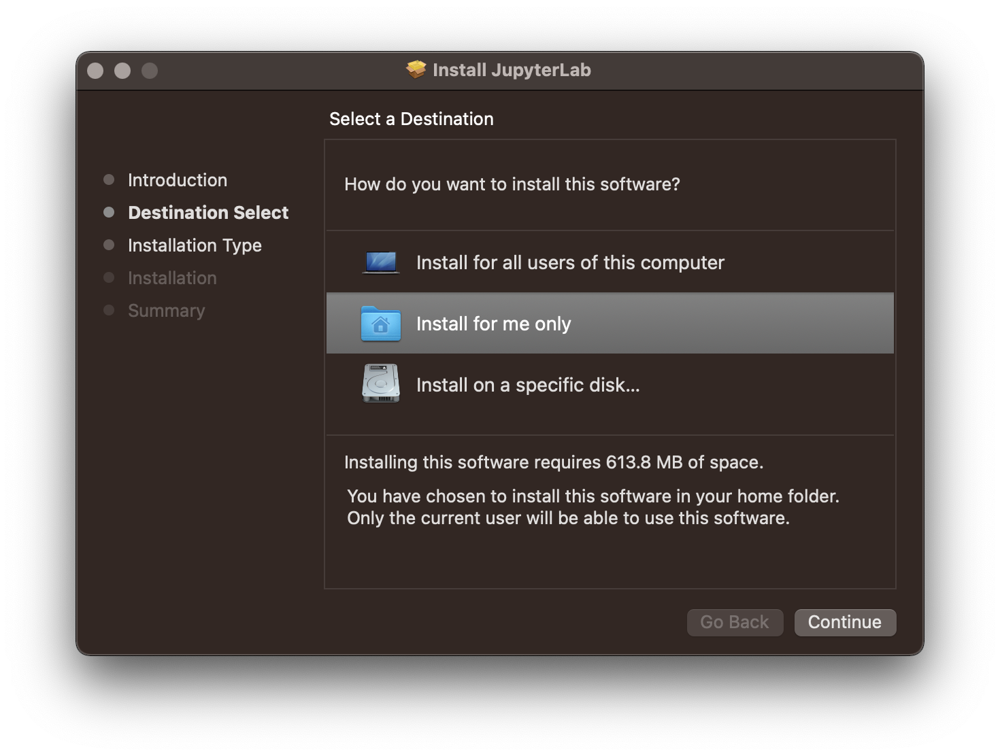
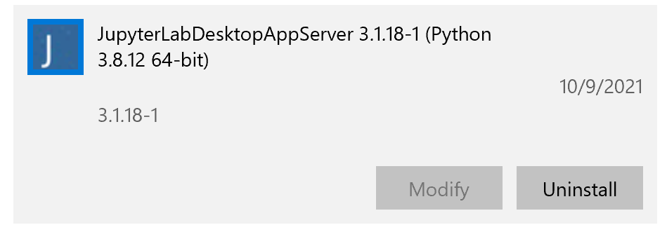
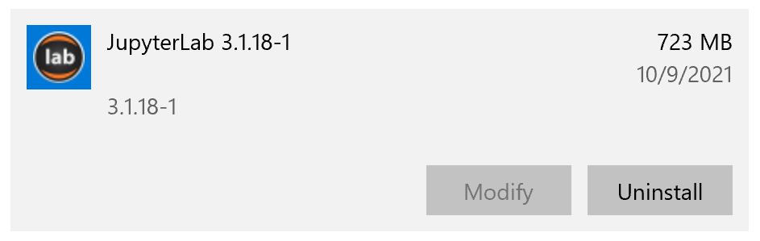

# Changing the Python Environment used by JupyterLab Desktop

JupyterLab Desktop comes with a bundled Python environment which has the essential Python packages for scientific computing and data science workflows. For more advanced use cases and specific needs, you can set the Python environment used by JupyterLab Desktop to another `conda`, `venv`, or `pyenv` virtual environment available on your computer. This feature also enables you to reuse the same Python environment, that has your custom package installations, when you upgrade to a newer version of JupyterLab Desktop. You can change the Python environment by following the steps below.

- Active Python environment info is shown on the status bar. If you hover on it you will see the details of the environment such as its path and certain package versions.



- Click on the status item to launch Python environment selector dialog.



- Choose `Use a custom Python environment` option and then click `Select Python path` button.

- Select the Python executable (`python.exe` on Windows and `python` on macOS & Linux) of the custom environment you would like to use. Python executable can be found at the root directory of the virtual environment on Windows and in then `bin` directory of the environment on macOS & Linux.

- Click `Save and restart` to apply the changes. Newly selected environment will be checked for compatibility before applying the changes and you will be notified of any incompatibility issues.

Python environment selection is saved in application settings and restored at application launch time. During launch, compatibility of the Python environment is checked and if found incompatible, Python environment selector dialog is shown to allow switching back to the bundled environment or using another compatible environment.

Application settings are stored in JSON format in the following locations. You can check the `pythonPath` setting in this file for troubleshooting. Setting it to empty string will cause JupyterLab Desktop to reset to the bundled Python environment.
- Windows: `%APPDATA%\jupyterlab-desktop\jupyterlab-desktop-data`
- macOS: `~/Library/Application\ Support/jupyterlab-desktop/jupyterlab-desktop-data`
- Linux: `$XDG_CONFIG_HOME/jupyterlab-desktop/jupyterlab-desktop-data` or `~/.config/jupyterlab-desktop/jupyterlab-desktop-data`

## How to create a Custom Python Environment
### Using conda
```bash
conda create -n custom_venv
conda activate custom_venv
conda install -c conda-forge jupyterlab==3.2.3
# install custom packages
conda install -c conda-forge scikit-learn
```

### Using venv
```bash
python3 -m venv custom_venv
source custom_venv/bin/activate
pip install --upgrade pip
pip install jupyterlab==3.2.3
# install custom packages
pip install scikit-learn
```

# Customizing the Bundled Python Environment

JupyterLab Desktop is a self-contained standalone desktop application which bundles a Python environment. The bundled Python environment comes with several popular Python libraries to make the application ready to use in scientific computing and data science workflows. These packages are `numpy`, `scipy`, `pandas`, `ipywidgets` and `matplotlib`. In order to install additional packages into JupyterLab Desktop's Python environment, you need to follow certain steps during and after the installation as described below.

## Linux Instructions

On Linux, JupyterLab Desktop is installed into `/opt/JupyterLab` and Python environment is created in `/opt/JupyterLab/resources/jlab_server`

- Install the application by double clicking the installer file and wait for the installation to finish.
- Linux installs JupyterLab Desktop as the root user. That's why it is necessary to change the ownership to the current user to be able to customize JupyterLab Desktop's Python environment.
- Before launching JupyterLab Desktop, open a Terminal and run the following command with your `username` to change application file system ownership.
```bash
sudo chown -R username:username /opt/JupyterLab
```

## macOS Instructions

On macOS, JupyterLab Desktop should be installed into `~/Applications/JupyterLab` for current user in order to allow environment customizations. Python environment is created in `~/Applications/JupyterLab.app/Contents/Resources/jlab_server`.

- Make sure you install the application for current user in order to allow changes to the bundled Python environment. It is not the default location of the installer, you can set it by following these steps

| Change Install Location  | Install for me only |
| ------------- | ------------- |
|  |  |


## Windows Instructions

On Windows, JupyterLab Desktop should be installed to default install location `C:\JupyterLab\`. There will be two installers running during setup. Keep the default paths for both installers. Python environment is created in `C:\JupyterLab\resources\jlab_server`.

# Installing New Python Packages

Make sure you installed JupyterLab Desktop following the steps outlined above in order to have required permissions to install new Python packages.

- Open a Notebook and run the command below in a cell for the package you want to install. You will see the log of the installation process as the cell output.
  ```bash
  %pip install <package_name>
  ```
  For example: to install scikit-learn
  ```bash
  %pip install scikit-learn
  ```
- In order to use the newly installed package you need to restart your active notebook's kernel or create a new notebook

# Uninstalling JupyterLab Desktop

## Debian, Ubuntu Linux
For versions 3.1.18-1 and newer
```bash
sudo apt-get purge jupyterlab-desktop # remove application
rm /usr/bin/jlab # remove command symlink
```
For versions 3.1.13-1 and older
```bash
sudo apt-get purge jupyterlab-app
```


## Red Hat, Fedora, SUSE Linux
For versions 3.1.18-1 and newer
```bash
sudo rpm -e jupyterlab-desktop # remove application
rm /usr/bin/jlab # remove command symlink
```
For versions 3.1.13-1 and older
```bash
sudo rpm -e jupyterlab_app
```

## macOS
Find the application installation `JupyterLab.app` in Finder (in ~/Applications or /Applications) and move to Trash by using `CMD + Delete`. Clean other application generated files using:

For versions 3.1.18-1 and newer
```bash
rm -rf ~/Library/Application\ Support/jupyterlab-desktop # remove application cache and session files
rm /usr/local/bin/jlab # remove command symlink
```
For versions 3.1.13-1 and older
```bash
rm -rf ~/Library/Application\ Support/jupyterlab_app # remove application cache and session files
```


## Windows

On Windows, JupyterLab Desktop is installed in two parts, one for the python environment and another for the application itself. Go to `Windows Apps & Features` dialog using `Start Menu` -> `Settings` -> `Apps` and make sure to uninstall the components in the following order:

- First uninstall JupyterLab Desktop python environment. Note that for JupyterLab Desktop version 3.1.18-1 and newer, this component will be named `JupyterLabDesktopAppServer` but for older versions it will be named `JupyterLabAppServer`.



- Then uninstall JupyterLab Desktop application



# Configuration

## Copying configuration from previous installation

Starting with version v3.2.4-2 the configuration (`jupyter-server` settings, `jupyterlab` settings and workspaces, etc)
is no longer shared between JupyterLab Desktop and other installations of Jupyter(Lab) to avoid workspace leakage,
user confusion, and errors such as reported by users who had a pre-existing configuration clashing with a newer
version of Jupyter shipped with JupyterLab Desktop.

You can keep your previous JupyterLab settings by copying them over to the new [configuration path](https://github.com/jupyterlab/jupyterlab-desktop#configuration-files):

1. Run `jupyter --paths` to determine where your `config` is stored.
2. Find directory called `lab` in one of these paths.
3. If there is a `user-settings` directory in `lab`, you can copy the `lab` directory over to the [configuration path](https://github.com/jupyterlab/jupyterlab-desktop#configuration-files) of JupyterLab Desktop to keep your old JupyterLab settings. If there is `workspaces` directory you can decide if you want to keep or remove it.

For example, on Linux it could (depending on installation) require the following:

```
cp -r ~/.jupyter/lab/ ~/.config/jupyterlab-desktop
```

**Warning**: If you copy over settings from an older major version of JupyterLab (e.g. 2.x) those might cause an error on startup.
