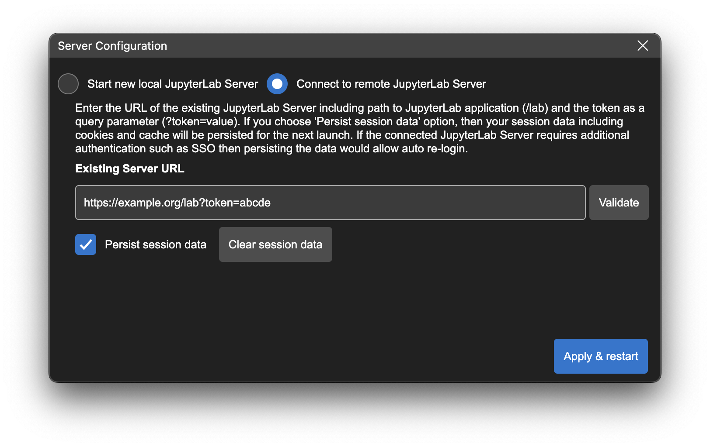

# Changing the Python Environment used by JupyterLab Desktop

JupyterLab Desktop comes with a bundled Python environment which has the essential Python packages for scientific computing and data science workflows. For more advanced use cases and specific needs, you can set the Python environment used by JupyterLab Desktop to another `conda`, `venv`, or `pyenv` virtual environment available on your computer. This feature also enables you to reuse the same Python environment, that has your custom package installations, when you upgrade to a newer version of JupyterLab Desktop. You can change the Python environment by following the steps below.

- Active Python environment info is shown on the status bar. If you hover on it you will see the details of the environment such as its path and certain package versions.


- Click on the status item to launch JupyterLab Server Configuration dialog.


- Choose `Use a custom Python environment` option and then click `Select Python path` button.

- Select the Python executable (`python.exe` on Windows and `python` on macOS & Linux) of the custom environment you would like to use. Python executable can be found at the root directory of the virtual environment on Windows and in the `bin` directory of the environment on macOS & Linux.

- Click `Apply and restart` to apply the changes. Newly selected environment will be checked for compatibility before applying the changes and you will be notified of any incompatibility issues.

Python environment selection is saved in application settings and restored at application launch time. During launch, compatibility of the Python environment is checked and if found incompatible, JupyterLab Server Configuration dialog is shown to allow switching back to the bundled environment or using another compatible environment.

Application settings are stored in JSON format in the following locations. You can check the `pythonPath` setting in this file for troubleshooting. Setting it to empty string will cause JupyterLab Desktop to reset to the bundled Python environment.

- Windows: `%APPDATA%\jupyterlab-desktop\jupyterlab-desktop-data`
- macOS: `~/Library/jupyterlab-desktop/jupyterlab-desktop-data`
- Linux: `$XDG_CONFIG_HOME/jupyterlab-desktop/jupyterlab-desktop-data` or `~/.config/jupyterlab-desktop/jupyterlab-desktop-data`

# Connecting to a remote JupyterLab Server

JupyterLab Desktop has two main components: the desktop client that is the frontend and the JupyterLab server which is the backend of the application. Frontend is designed to connect to any compatible JupyterLab server as its backend. JupyterLab Desktop can automatically launch a JupyterLab server at startup and connect to it, and it can also connect to an existing JupyterLab server instance that is running locally or remotely.



JupyterLab Server Configuration dialog lets you configure the backend connection by providing `Start new local JupyterLab Server` and `Connect to remote JupyterLab Server` options. In order to connect to an existing JupyterLab server, select `Connect to remote JupyterLab Server` and enter the URL of the JupyterLab application including `/lab` in the URL. If the server requires a token for authentication, make sure to include it as a query parameter of the URL as well (`/lab?token=<token-value>`). Click the `Validate` button to test the connection and check if the URL is for a valid JupyterLab server.

JupyterLab Desktop can connect to remote server instances that require additional authentication such as Single Sign-On (SSO). If the `Persist session data` option is checked, then the session information is stored and JupyterLab Desktop will re-use this data on the next launch. If this option is not checked, the session data is automatically deleted at the next launch and servers requiring authentication will prompt for re-login. You can delete the stored session data manually at any time by clicking the `Clear session data` button. Session data is automatically deleted when server URL is updated and when user switches to `Start new local JupyterLab Server` option as well.

## How to create a Custom Python Environment

### Using conda

```bash
conda create -n custom_venv
conda activate custom_venv
conda install -c conda-forge jupyterlab==3.2.3
# install custom packages
conda install -c conda-forge scikit-learn
```

### Using venv

```bash
python3 -m venv custom_venv
source custom_venv/bin/activate
pip install --upgrade pip
pip install jupyterlab==3.2.3
# install custom packages
pip install scikit-learn
```

# Customizing the Bundled Python Environment

JupyterLab Desktop is a self-contained standalone desktop application which bundles a Python environment. The bundled Python environment comes with several popular Python libraries to make the application ready to use in scientific computing and data science workflows. These packages are `numpy`, `scipy`, `pandas`, `ipywidgets` and `matplotlib`. In order to install additional packages into JupyterLab Desktop's Python environment, you need to follow certain steps during and after the installation as described below.

## Linux Instructions

On Linux, JupyterLab Desktop is installed into `/opt/JupyterLab` and Python environment is created in `~/.config/jupyterlab-desktop/jlab_server`

## macOS Instructions

On macOS, JupyterLab Desktop is installed into `/Applications/JupyterLab` and Python environment is created in `~/Library/jupyterlab-desktop/jlab_server`.

## Windows Instructions

On Windows, there are two installers, one of them is run during initial setup for the main JupyterLab Desktop applicationa and the other one is run when a Python environment needs to be installed. Both of them should be installed to their default install locations. It is `C:\JupyterLab\` for JupyterLab Desktop and `C:\Users\<username>\AppData\Roaming\jupyterlab-desktop\jlab_server` for JupyterLab Desktop Server.

# Installing New Python Packages

Make sure you installed JupyterLab Desktop following the steps outlined above in order to have required permissions to install new Python packages.

- Open a Notebook and run the command below in a cell for the package you want to install. You will see the log of the installation process as the cell output.
  ```bash
  %pip install <package_name>
  ```
  For example: to install scikit-learn
  ```bash
  %pip install scikit-learn
  ```
- In order to use the newly installed package you need to restart your active notebook's kernel or create a new notebook

# Uninstalling JupyterLab Desktop

## Debian, Ubuntu Linux

```bash
sudo apt-get purge jupyterlab-desktop # remove application
rm /usr/bin/jlab # remove command symlink

# to remove application cache and bundled Python environment
rm -rf ~/.config/jupyterlab-desktop
```

## Red Hat, Fedora, SUSE Linux

```bash
sudo rpm -e jupyterlab-desktop # remove application
rm /usr/bin/jlab # remove command symlink

# to remove application cache and bundled Python environment
rm -rf ~/.config/jupyterlab-desktop
```

## macOS

Find the application installation `JupyterLab.app` in Finder (in /Applications or ~/Applications) and move to Trash by using `CMD + Delete`. Clean other application generated files using:

For versions 3.3.2-2 and newer

```bash
rm /usr/local/bin/jlab # remove command symlink

# to remove application cache and bundled Python environment
rm -rf ~/Library/jupyterlab-desktop
```

For versions 3.3.2-1 and older

```bash
rm /usr/local/bin/jlab # remove command symlink

# to remove application cache and bundled Python environment
rm -rf ~/Library/Application\ Support/jupyterlab-desktop
```

## Windows

On Windows, JupyterLab Desktop is installed in two parts, one for the python environment and another for the application itself. Go to `Windows Apps & Features` dialog using `Start Menu` -> `Settings` -> `Apps` and make sure to uninstall the components in the following order:

- First uninstall JupyterLab Desktop python environment


- Then uninstall JupyterLab Desktop application


In order to remove application cache, delete `C:\Users\<username>\AppData\Roaming\jupyterlab-desktop` directory.

# Configuration

## Copying configuration from previous installation

Starting with version v3.2.4-2 the configuration (`jupyter-server` settings, `jupyterlab` settings and workspaces, etc)
is no longer shared between JupyterLab Desktop and other installations of Jupyter(Lab) to avoid workspace leakage,
user confusion, and errors such as reported by users who had a pre-existing configuration clashing with a newer
version of Jupyter shipped with JupyterLab Desktop.

You can keep your previous JupyterLab settings by copying them over to the new [configuration path](https://github.com/jupyterlab/jupyterlab-desktop#configuration-files):

1. Run `jupyter --paths` to determine where your `config` is stored.
2. Find directory called `lab` in one of these paths.
3. If there is a `user-settings` directory in `lab`, you can copy the `lab` directory over to the [configuration path](https://github.com/jupyterlab/jupyterlab-desktop#configuration-files) of JupyterLab Desktop to keep your old JupyterLab settings. If there is `workspaces` directory you can decide if you want to keep or remove it.

For example, on Linux it could (depending on installation) require the following:

```
cp -r ~/.jupyter/lab/ ~/.config/jupyterlab-desktop
```

**Warning**: If you copy over settings from an older major version of JupyterLab (e.g. 2.x) those might cause an error on startup.
