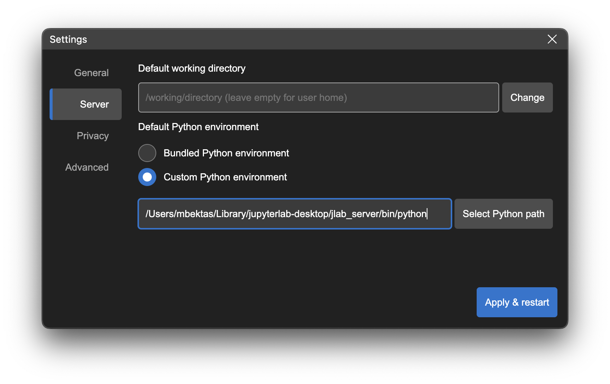

# Changing the Python Environment used by JupyterLab Desktop

JupyterLab Desktop comes with a bundled Python environment which has the essential Python packages for scientific computing and data science workflows. For more advanced use cases and specific needs, you can set the Python environment used by JupyterLab Desktop to another `conda`, `venv`, or `pyenv` virtual environment available on your computer.

Active Python environment info is shown on the title bar. If you hover on it you will see the details of the environment such as its path and certain package versions, along with the currently running JupyterLab server instance information.

 

JupyterLab Desktop allows you to change the default Python environment used for all new sessions and also set project (working directory) specific Python environments.

### To change the default Python environment:
- Open the settings dialog from the to right menu and go to `Server` tab.



- In Server tab, select `Custom Python environment` option and either enter the path to Python executable you would like to use or click `Select Python path` to browse for it.

- Environment selection will be applied at the next launch of the application

### To set project specific Python environment:

- Click on the server status button on the title bar to launch Python environment selector menu. Compatible Python environments discovered on your computer and any previously used environments will be listed in the menu.


- You can choose from one of the Python paths listed on the menu or click the browse button on top right to browse and select any other Python paths existing on your computer.

- If you are browsing for a Python path, select the Python executable (`python.exe` on Windows and `python` on macOS & Linux) of the custom environment you would like to use. Python executable can be found at the root directory of the virtual environment on Windows and in the `bin` directory of the environment on macOS & Linux.

- You can also paste a Python path from the clipboard into the input field and hit `Enter` key to select it.

- Once you select a new environment, JupyterLab server will be restarted using the new environment without restarting the application.

Python environment selections are saved in user settings or project settings and restored at launch. See the [Configuration and data files](#Configuration-and-data-files) section for more information about the settings storage. Python environment is stored with `pythonPath` key in those files. Setting the value to empty string or removing the key will reset the change.

# Connecting to a an existing JupyterLab Server

JupyterLab Desktop creates new JupyterLab sessions by launching a locally running JupyterLab server and connecting to it. It can also connect to an existing JupyterLab server instance that is running locally or remotely. In order to connect to a server, click the `Connect...` button in the Start section of the Welcome Page.


This will launch a dialog that automatically discovers and lists the locally running JupyterLab server instances and previously connected local or remote servers in the app history.


Select a server from the list or enter the URL of the JupyterLab application server including `/lab` in the URL. If the server requires a token for authentication, make sure to include it as a query parameter of the URL as well (`/lab?token=<token-value>`). After entering a URL hit `Enter` key to connect.

JupyterLab Desktop can connect to remote server instances that require additional authentication such as Single Sign-On (SSO). If the `Persist session data` option is checked, then the session information is stored and JupyterLab Desktop will re-use this data on the next launch. If this option is not checked, the session data is automatically deleted at the next launch and servers requiring authentication will prompt for re-login.

You can delete the stored session data manually at any time by using the `Clear History` option in the Privacy tab of Settings dialog.


## How to create a Custom Python Environment

### Using conda

```bash
conda create -n custom_venv
conda activate custom_venv
conda install -c conda-forge jupyterlab==3.2.3
# install custom packages
conda install -c conda-forge scikit-learn
```

### Using venv

```bash
python3 -m venv custom_venv
source custom_venv/bin/activate
pip install --upgrade pip
pip install jupyterlab==3.2.3
# install custom packages
pip install scikit-learn
```

# Customizing the Bundled Python Environment

JupyterLab Desktop is a self-contained standalone desktop application which bundles a Python environment. The bundled Python environment comes with several popular Python libraries to make the application ready to use in scientific computing and data science workflows. These packages are `numpy`, `scipy`, `pandas`, `ipywidgets` and `matplotlib`. In order to install additional packages into JupyterLab Desktop's Python environment, you need to follow certain steps during and after the installation as described below.

## Linux Instructions

On Linux, JupyterLab Desktop is installed into `/opt/JupyterLab` and Python environment is created in `~/.config/jupyterlab-desktop/jlab_server`

## macOS Instructions

On macOS, JupyterLab Desktop is installed into `/Applications/JupyterLab` and Python environment is created in `~/Library/jupyterlab-desktop/jlab_server`.

## Windows Instructions

On Windows, there are two installers, one of them is run during initial setup for the main JupyterLab Desktop applicationa and the other one is run when a Python environment needs to be installed. Both of them should be installed to their default install locations. It is `C:\JupyterLab\` for JupyterLab Desktop and `C:\Users\<username>\AppData\Roaming\jupyterlab-desktop\jlab_server` for JupyterLab Desktop Server.

# Installing New Python Packages

Make sure you installed JupyterLab Desktop following the steps outlined above in order to have required permissions to install new Python packages.

- Open a Notebook and run the command below in a cell for the package you want to install. You will see the log of the installation process as the cell output.
  ```bash
  %pip install <package_name>
  ```
  For example: to install scikit-learn
  ```bash
  %pip install scikit-learn
  ```
- In order to use the newly installed package you need to restart your active notebook's kernel or create a new notebook

# Uninstalling JupyterLab Desktop

## Debian, Ubuntu Linux

```bash
sudo apt-get purge jupyterlab-desktop # remove application
rm /usr/bin/jlab # remove command symlink

# to remove application cache and bundled Python environment
rm -rf ~/.config/jupyterlab-desktop
```

## Red Hat, Fedora, SUSE Linux

```bash
sudo rpm -e jupyterlab-desktop # remove application
rm /usr/bin/jlab # remove command symlink

# to remove application cache and bundled Python environment
rm -rf ~/.config/jupyterlab-desktop
```

## macOS

Find the application installation `JupyterLab.app` in Finder (in /Applications or ~/Applications) and move to Trash by using `CMD + Delete`. Clean other application generated files using:

For versions 3.3.2-2 and newer

```bash
rm /usr/local/bin/jlab # remove command symlink

# to remove application cache and bundled Python environment
rm -rf ~/Library/jupyterlab-desktop
```

For versions 3.3.2-1 and older

```bash
rm /usr/local/bin/jlab # remove command symlink

# to remove application cache and bundled Python environment
rm -rf ~/Library/Application\ Support/jupyterlab-desktop
```

## Windows

On Windows, JupyterLab Desktop is installed in two parts, one for the python environment and another for the application itself. Go to `Windows Apps & Features` dialog using `Start Menu` -> `Settings` -> `Apps` and make sure to uninstall the components in the following order:

- First uninstall JupyterLab Desktop python environment


- Then uninstall JupyterLab Desktop application


In order to remove application cache, delete `C:\Users\<username>\AppData\Roaming\jupyterlab-desktop` directory.

# Configuration and data files

JupyterLab Desktop stores user settings, project settings and application data in different locations as JSON files. Below are the storage locations and type of data they contain.

- User settings: `{jlab-desktop-user-data-dir}/settings.json`

  This file contains application settings such as default Python path and theme. These settings can be configured from Settings dialog in the application UI.

- Project settings: `{working-directory}/.jupyter/desktop-settings.json`

  This file contains project (working directory) specific overrides of user settings. Currently only `pythonPath` (which is the Python executable path for the Python environment to use for the working directory) setting can be overridden.

- Application data: `{jlab-desktop-user-data-dir}/app-data.json`

  This file contains data used by the application, e.g. recent sessions list, news feed cache, Python environment list cache.

`{jlab-desktop-user-data-dir}` is OS specific and as below

- `%APPDATA%\jupyterlab-desktop` on Windows
- `$XDG_CONFIG_HOME/jupyterlab-desktop` or `~/.config/jupyterlab-desktop` on Linux
- `~/Library/Application Support/jupyterlab-desktop` on macOS

JupyterLab Desktop also uses custom configuration paths for better user experience and to prevent clashes with existing Jupyter installations.

Jupyter config files directory (`JUPYTER_CONFIG_DIR`) is set to `{jlab-desktop-user-data-dir}`. jupyter-server settings, jupyterlab settings, and any other Jupyter configuration are saved to and loaded from this directory. You can change the configuration path by specifying `JLAB_DESKTOP_CONFIG_DIR` environment variable.

JupyterLab workspace data is stored into the working directory, for each folder a new session is started in. This allows restoring open files and UI layout of sessions for different working directories. `{working-directory}/.jupyter/desktop-workspaces` directory is automatically created and used to save and load workspace data for each working directory. You can change this behavior by specifying `JLAB_DESKTOP_WORKSPACES_DIR` environment variable.

## Copying configuration from previous installation

Starting with version v3.2.4-2 the configuration (`jupyter-server` settings, `jupyterlab` settings and workspaces, etc)
is no longer shared between JupyterLab Desktop and other installations of Jupyter(Lab) to avoid workspace leakage,
user confusion, and errors such as reported by users who had a pre-existing configuration clashing with a newer
version of Jupyter shipped with JupyterLab Desktop.

You can keep your previous JupyterLab settings by copying them over to the new [configuration path](https://github.com/jupyterlab/jupyterlab-desktop#configuration-files):

1. Run `jupyter --paths` to determine where your `config` is stored.
2. Find directory called `lab` in one of these paths.
3. If there is a `user-settings` directory in `lab`, you can copy the `lab` directory over to the [configuration path](https://github.com/jupyterlab/jupyterlab-desktop#configuration-files) of JupyterLab Desktop to keep your old JupyterLab settings. If there is `workspaces` directory you can decide if you want to keep or remove it.

For example, on Linux it could (depending on installation) require the following:

```
cp -r ~/.jupyter/lab/ ~/.config/jupyterlab-desktop
```

**Warning**: If you copy over settings from an older major version of JupyterLab (e.g. 2.x) those might cause an error on startup.
